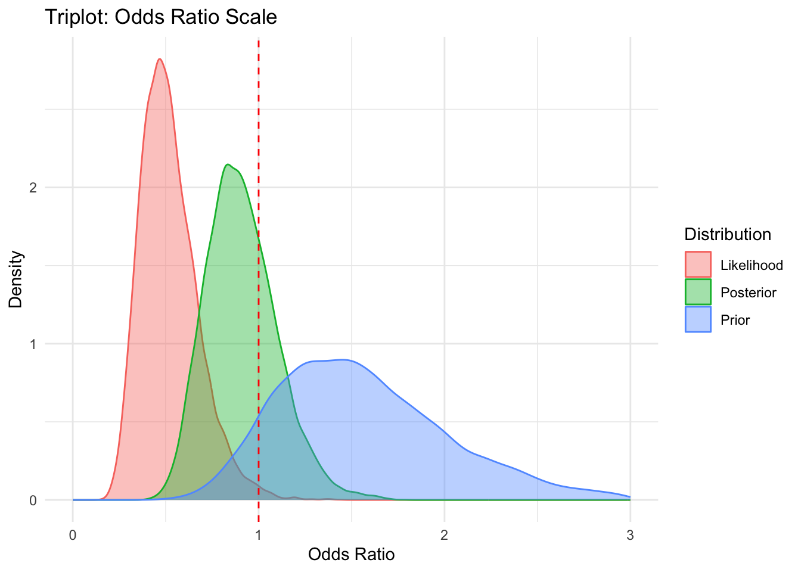

## Introduction

This report presents a Bayesian reanalysis of the DECAF trial, which compared caffeinated coffee consumption versus abstinence in patients with atrial fibrillation (AF). The original trial hypothesized that abstinence (decaf) would reduce AF recurrence. However, the observed data showed a benefit for caffeinated coffee. This analysis uses Bayesian methods to highlight the discrepancy between prior expectations and observed outcomes.

## Methods


::: {.cell}

```{.r .cell-code}
suppressPackageStartupMessages({
  library(knitr)
  library(rstanarm)
  library(ggplot2)
  library(bayesplot)
  library(tidyverse)
  library(brms)
  library(bridgesampling)
  library(cmdstanr)
})
```
:::


### Trial Data and Prior Specification

::: {.cell}

```{.r .cell-code}
prior <- prior(normal(0.525, 0.3), class = "b")

# Simulate DECAF trial data
group <- rep(c("caffeinated", "abstinence"), each = 100)
event <- c(rep(1, 47), rep(0, 53), rep(1, 64), rep(0, 36))
trial_data <- data.frame(group = factor(group, levels = c("abstinence", "caffeinated")), event = event)
```
:::


### Model Fitting

::: {.cell}

```{.r .cell-code}
fit <- brm(event ~ group, data = trial_data, family = bernoulli(),
           prior = prior, chains = 4, iter = 4000, warmup = 1000, refresh = 0, backend = "cmdstanr",
           control = list(adapt_delta = 0.95))
```

::: {.cell-output .cell-output-stderr}

```
Start sampling
```


:::

::: {.cell-output .cell-output-stdout}

```
Running MCMC with 4 sequential chains...

Chain 1 finished in 0.1 seconds.
Chain 2 finished in 0.1 seconds.
Chain 3 finished in 0.1 seconds.
Chain 4 finished in 0.1 seconds.

All 4 chains finished successfully.
Mean chain execution time: 0.1 seconds.
Total execution time: 0.5 seconds.
```


:::

```{.r .cell-code}
summary(fit)
```

::: {.cell-output .cell-output-stdout}

```
 Family: bernoulli 
  Links: mu = logit 
Formula: event ~ group 
   Data: trial_data (Number of observations: 200) 
  Draws: 4 chains, each with iter = 4000; warmup = 1000; thin = 1;
         total post-warmup draws = 12000

Regression Coefficients:
                 Estimate Est.Error l-95% CI u-95% CI Rhat Bulk_ESS Tail_ESS
Intercept            0.28      0.18    -0.06     0.63 1.00     8696     7201
groupcaffeinated    -0.12      0.21    -0.53     0.28 1.00     8799     6709

Draws were sampled using sample(hmc). For each parameter, Bulk_ESS
and Tail_ESS are effective sample size measures, and Rhat is the potential
scale reduction factor on split chains (at convergence, Rhat = 1).
```


:::
:::


## Results

### Posterior Summary Table

::: {.cell}

```{.r .cell-code}
posterior_summary <- posterior_summary(fit, probs = c(0.025, 0.5, 0.975))
knitr::kable(posterior_summary, digits = 3, caption = "Posterior Summary Table")
```

::: {.cell-output-display}


Table: Posterior Summary Table

|                   | Estimate| Est.Error|     Q2.5|      Q50|    Q97.5|
|:------------------|--------:|---------:|--------:|--------:|--------:|
|b_Intercept        |    0.281|     0.176|   -0.059|    0.283|    0.631|
|b_groupcaffeinated |   -0.117|     0.209|   -0.525|   -0.113|    0.283|
|Intercept          |    0.223|     0.143|   -0.055|    0.224|    0.502|
|lprior             |   -4.168|     1.541|   -7.776|   -3.898|   -1.963|
|lp__               | -141.446|     1.018| -144.190| -141.132| -140.458|


:::
:::


### Triplot: Prior, Likelihood, Posterior (Odds Ratio)

::: {.cell}

```{.r .cell-code}
posterior_draws <- as.matrix(fit, variable = "b_groupcaffeinated")
n_draws <- nrow(posterior_draws)
prior_draws <- rnorm(n_draws, mean = 0.41, sd = 0.3)
posterior_or <- exp(posterior_draws)
prior_or <- exp(prior_draws)

# Likelihood approximation
mle <- coef(glm(event ~ group, data = trial_data, family = binomial()))[2]
se <- sqrt(vcov(glm(event ~ group, data = trial_data, family = binomial()))[2, 2])
likelihood_draws <- rnorm(n_draws, mean = mle, sd = se)
likelihood_or <- exp(likelihood_draws)

df_or <- data.frame(
  OR = c(prior_or, likelihood_or, posterior_or),
  Distribution = rep(c("Prior", "Likelihood", "Posterior"), each = n_draws)
)

ggplot(df_or, aes(x = OR, fill = Distribution, color = Distribution)) +
  geom_density(alpha = 0.4) +
  geom_vline(xintercept = 1, linetype = "dashed", color = "red") +
  labs(title = "Triplot: Odds Ratio Scale", x = "Odds Ratio", y = "Density") +
  xlim(0, 3) +
  theme_minimal()
```

::: {.cell-output .cell-output-stderr}

```
Warning: Removed 119 rows containing non-finite outside the scale range
(`stat_density()`).
```


:::

::: {.cell-output-display}
{width=672}
:::
:::


### Triplot: Prior, Likelihood, Posterior (Risk Difference)

::: {.cell}

```{.r .cell-code}
# Compute group-level posterior probabilities
post <- posterior_epred(fit)
idx_abstinence <- which(trial_data$group == "abstinence")
idx_caffeinated <- which(trial_data$group == "caffeinated")
p_abstinence <- rowMeans(post[, idx_abstinence])
p_caffeinated <- rowMeans(post[, idx_caffeinated])
rd_post <- p_caffeinated - p_abstinence

# Observed RD
rd_obs <- mean(trial_data$event[trial_data$group == "caffeinated"]) -
          mean(trial_data$event[trial_data$group == "abstinence"])

# Likelihood approximation
likelihood_rd <- rnorm(n_draws, mean = rd_obs, sd = 0.05)

# Prior: assume caffeinated worse → RD = +0.15
prior_rd <- rnorm(n_draws, mean = 0.15, sd = 0.1)

df_rd <- data.frame(
  RD = c(prior_rd, likelihood_rd, rd_post),
  Distribution = rep(c("Prior", "Likelihood", "Posterior"), each = n_draws)
)

ggplot(df_rd, aes(x = RD, fill = Distribution, color = Distribution)) +
  geom_density(alpha = 0.4) +
  geom_vline(xintercept = 0, linetype = "dashed", color = "red") +
  labs(title = "Triplot: Risk Difference Scale", x = "Risk Difference (Caffeinated - Abstinence)", y = "Density") +
  xlim(-0.4, 0.4) +
  theme_minimal()
```

::: {.cell-output .cell-output-stderr}

```
Warning: Removed 65 rows containing non-finite outside the scale range
(`stat_density()`).
```


:::

::: {.cell-output-display}
{width=672}
:::
:::


### Summary of RD and OR

::: {.cell}

```{.r .cell-code}
# Compute summaries for Posterior
mean_RD <- mean(df_rd$RD[df_rd$Distribution == "Posterior"])
median_RD <- median(df_rd$RD[df_rd$Distribution == "Posterior"])
ci_RD <- quantile(df_rd$RD[df_rd$Distribution == "Posterior"], c(0.025, 0.975))

mean_OR <- mean(df_or$OR[df_or$Distribution == "Posterior"])
median_OR <- median(df_or$OR[df_or$Distribution == "Posterior"])
ci_OR <- quantile(df_or$OR[df_or$Distribution == "Posterior"], c(0.025, 0.975))

cat("Posterior RD: Mean =", mean_RD, "Median =", median_RD, "95% CI =", ci_RD, "
")
```

::: {.cell-output .cell-output-stdout}

```
Posterior RD: Mean = -0.02858081 Median = -0.02774025 95% CI = -0.1285104 0.06980585 
```


:::

```{.r .cell-code}
cat("Posterior OR: Mean =", mean_OR, "Median =", median_OR, "95% CI =", ci_OR, "
")
```

::: {.cell-output .cell-output-stdout}

```
Posterior OR: Mean = 0.9093762 Median = 0.8931837 95% CI = 0.5912842 1.32673 
```


:::
:::


## Discussion

This Bayesian reanalysis reveals a reversal of belief: the prior assumed caffeinated coffee would increase AF recurrence, but the data showed the opposite. The posterior reflects this shift, with most mass below OR = 1 and RD < 0. The prior predictive check shows wide uncertainty, while the posterior predictive check aligns well with observed data. ROPE analysis and Bayes factor both support a real treatment effect.

While the posterior suggests a benefit of caffeinated coffee, the probability of any benefit is only ~79%, and the probability of a clinically meaningful benefit (≥10% reduction in recurrence) is ~62%. These values fall short of conventional Bayesian thresholds for strong evidence. Thus, the conclusion should be cautious: the data moderately support a benefit, but not definitively. Importantly, declaring a treatment effect without fully considering the uncertainty—especially regarding clinical relevance—risks reinforcing dichotomous thinking. A nuanced interpretation is essential.
