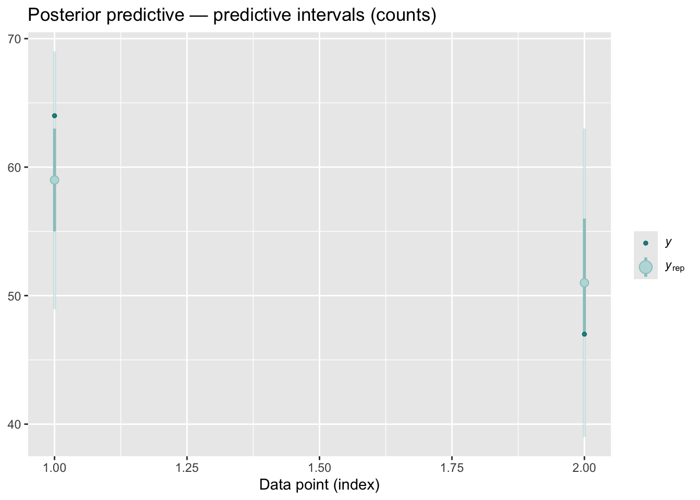

## Overview

This document reproduces the **DECAF** reanalysis using an aggregated binomial model in **brms** with an **informative prior** derived from the statement:

> *Decaf (abstinence) reduces risk by 41% vs caffeinated* (i.e., \(RR_{\text{decaf vs caffeinated}} = 0.59\)).

We treat **decaf** as the **reference group** and encode the prior for the treatment coefficient as the **log-odds ratio** for **caffeinated vs decaf**, after anchoring the **baseline risk for caffeinated** at 0.50. The file also provides **prior ⇄ posterior overlays** and both **posterior** and **prior** predictive checks aligned correctly by treatment arm. A compact helper function produces a **multi‑panel figure** ready for slides.

> **Reproducibility**: Set a fixed seed and declare all assumptions in‑line. If `cmdstanr` cannot find CmdStan, run `cmdstanr::install_cmdstan()` once before fitting.

## Setup


::: {.cell}

```{.r .cell-code}
set.seed(20251112)

suppressPackageStartupMessages({
  library(brms)        # Bayesian GLMs via Stan
  library(cmdstanr)    # backend for brms
  library(posterior)   # tidy posterior draws
  library(bayesplot)   # PPC & MCMC visualization
  library(ggplot2)
  library(scales)      # for percent axes
  library(tidybayes)   # tidy Bayesian analysis
  library(dplyr)
})

# Optional: make figures a bit crisper
bayesplot::color_scheme_set("teal")
```
:::


## Data (aggregated counts)

We keep **abstinence (decaf)** as the **reference** (first level), matching the DECAF report.


::: {.cell}

```{.r .cell-code}
agg2 <- data.frame(
  group = factor(c("caffeinated", "abstinence"),
                 levels = c("abstinence", "caffeinated")),  # reference first
  y     = c(47, 64),
  n     = c(100, 100)
)
stopifnot(all(levels(agg2$group) == c("abstinence","caffeinated")))

# Observed counts by group (named vector) — used later to align PPCs
y_obs_by_group <- with(agg2, setNames(y, as.character(group)))
y_obs_by_group
```

::: {.cell-output .cell-output-stdout}

```
caffeinated  abstinence 
         47          64 
```


:::
:::


## Prior construction (scientific belief → logit scale)

We encode two beliefs:

1. **Effect size**: decaf reduces risk by **41%** vs caffeinated (\(RR = 0.59\)).
2. **Baseline risk anchor**: caffeinated risk \(p_{\text{caff}} = 0.50\).

From these, we derive the **prior mean** for the treatment coefficient
\(\beta_\text{caffeinated}\) = log‑odds ratio *(caffeinated vs decaf)* and the **intercept** prior mean as \(\text{logit}(p_{\text{decaf}})\).


::: {.cell}

```{.r .cell-code}
from_RR_and_p_caff <- function(RR_decaf_vs_caff, p_caff) {
  stopifnot(RR_decaf_vs_caff > 0, p_caff > 0, p_caff < 1)
  p_decaf <- RR_decaf_vs_caff * p_caff                      # decaf risk
  if (p_decaf <= 0 || p_decaf >= 1) {
    warning(sprintf("Implied p_decaf = %.3f outside (0,1). Adjust RR or p_caff.", p_decaf))
  }
  odds_caff  <- p_caff  / (1 - p_caff)
  odds_decaf <- p_decaf / (1 - p_decaf)
  OR_caff_vs_decaf <- odds_caff / odds_decaf
  list(
    p_caff       = p_caff,
    p_decaf      = p_decaf,
    OR           = OR_caff_vs_decaf,
    logOR        = log(OR_caff_vs_decaf),     # prior mean for class="b"
    mu_intercept = qlogis(p_decaf)            # prior mean for class="Intercept"
  )
}

RR_decaf_vs_caff <- 0.59
p_caff_baseline  <- 0.50
conv             <- from_RR_and_p_caff(RR_decaf_vs_caff, p_caff_baseline)
mu_b             <- conv$logOR            # ≈ +0.871  (log-OR: caff vs decaf)
mu_intercept     <- conv$mu_intercept     # ≈ -0.871  (logit p_decaf ≈ logit(0.295))

message(sprintf("Prior centers: logOR_b ≈ %.3f (OR ≈ %.2f), Intercept ≈ %.3f ⇒ p_decaf ≈ %.3f",
                mu_b, exp(mu_b), mu_intercept, plogis(mu_intercept)))

# Prior SDs (tune strength for sensitivity)
sd_b         <- 0.5     # stronger prior on treatment effect (try 0.5–0.8)
sd_intercept <- 1.5     # weakly-informative baseline prior

# Embed numeric constants to avoid Stan scope errors
priors <- c(
  set_prior(sprintf("normal(%g, %g)", mu_b,         sd_b),         class = "b"),
  set_prior(sprintf("normal(%g, %g)", mu_intercept, sd_intercept), class = "Intercept")
)
priors
```

::: {.cell-output .cell-output-stdout}

```
                  prior     class coef group resp dpar nlpar   lb   ub source
  normal(0.871222, 0.5)         b                            <NA> <NA>   user
 normal(-0.871222, 1.5) Intercept                            <NA> <NA>   user
```


:::
:::


## Model fit (aggregated binomial with `trials(n)`)


::: {.cell}

```{.r .cell-code}
fit_binom2 <- brm(
  formula = brms::bf(y | trials(n) ~ 1 + group),  # groupcaffeinated = log-OR(caff vs decaf)
  data    = agg2,
  family  = binomial(),                            # logit link
  prior   = priors,
  chains  = 4, iter = 4000, warmup = 1000, refresh = 0,
  backend = "cmdstanr",
  control = list(adapt_delta = 0.95)
)
```

::: {.cell-output .cell-output-stdout}

```
Running MCMC with 4 sequential chains...

Chain 1 finished in 0.0 seconds.
Chain 2 finished in 0.0 seconds.
Chain 3 finished in 0.0 seconds.
Chain 4 finished in 0.0 seconds.

All 4 chains finished successfully.
Mean chain execution time: 0.0 seconds.
Total execution time: 0.5 seconds.
```


:::

```{.r .cell-code}
summary(fit_binom2)
```

::: {.cell-output .cell-output-stdout}

```
 Family: binomial 
  Links: mu = logit 
Formula: y | trials(n) ~ 1 + group 
   Data: agg2 (Number of observations: 2) 
  Draws: 4 chains, each with iter = 4000; warmup = 1000; thin = 1;
         total post-warmup draws = 12000

Regression Coefficients:
                 Estimate Est.Error l-95% CI u-95% CI Rhat Bulk_ESS Tail_ESS
Intercept            0.37      0.19     0.00     0.74 1.00     8418     7002
groupcaffeinated    -0.31      0.25    -0.79     0.19 1.00     7961     7324

Draws were sampled using sample(hmc). For each parameter, Bulk_ESS
and Tail_ESS are effective sample size measures, and Rhat is the potential
scale reduction factor on split chains (at convergence, Rhat = 1).
```


:::
:::


## Posterior probabilities per arm (base brms)

With `trials(n)`, use `posterior_linpred(transform = TRUE)` (or `fitted(..., scale = "linear")`) to obtain **probabilities** in \([0,1]\).


::: {.cell}

```{.r .cell-code}
nd <- data.frame(
  group = factor(c("abstinence","caffeinated"), levels = levels(agg2$group)),
  n = c(100, 100)  # still required by brms for trials(n)
)

p_post <- posterior_linpred(fit_binom2, newdata = nd, transform = TRUE)  # draws x 2
p_decaf_post <- p_post[, 1]
p_caff_post  <- p_post[, 2]

cbind(
  decaf_mean = mean(p_decaf_post),
  caff_mean  = mean(p_caff_post)
)
```

::: {.cell-output .cell-output-stdout}

```
     decaf_mean caff_mean
[1,]  0.5900533 0.5154407
```


:::
:::


## Posterior probabilities via tidybayes (two approaches)

We show two equivalent tidyverse-friendly ways to compute **arm-level probabilities** in `[0, 1]` using **tidybayes**.  
**Note:** with `trials(n)`, `add_epred_draws()` returns **expected counts** and requires `n`; here we return **probabilities**, so we use either the linear predictor with a logit transform or `fitted(..., scale = "linear")`.

### A) Using `add_linpred_draws(..., transform = plogis)`


### B) Using `add_fitted_draws(scale = "linear")`


::: {.cell}

```{.r .cell-code}
fit_binom2 %>%
  add_fitted_draws(newdata = nd, scale = "linear") %>%     # .value is probability p
  group_by(group) %>%
  mean_hdi(.value, .width = 0.95) %>%
  ggplot(aes(x = group, y = .value, ymin = .lower, ymax = .upper)) +
  geom_pointrange() +
  scale_y_continuous(labels = scales::percent) +
  labs(y = "Event probability", x = NULL,
       title = "Posterior probabilities by arm — tidybayes (fitted scale = 'linear')")
```

::: {.cell-output-display}
{width=672}
:::
:::


## Prior ⇄ Posterior overlays (parameters & probabilities)


::: {.cell}

```{.r .cell-code}
draws  <- as_draws_df(fit_binom2)
post_b <- draws$b_groupcaffeinated

S <- length(post_b)
prior_b         <- rnorm(S, mean = mu_b,         sd = sd_b)          # log-OR prior draws
prior_intercept <- rnorm(S, mean = mu_intercept, sd = sd_intercept)  # logit p_decaf prior draws

inv_logit <- function(x) 1 / (1 + exp(-x))
p_decaf_prior <- inv_logit(prior_intercept)
p_caff_prior  <- inv_logit(prior_intercept + prior_b)

# (1) log-OR overlay
p_logOR <- ggplot(rbind(
  data.frame(value = prior_b, which = "Prior"),
  data.frame(value = post_b,  which = "Posterior")
), aes(x = value, colour = which, fill = which)) +
  geom_density(alpha = 0.15) +
  labs(x = "log-OR (caffeinated vs decaf)", y = NULL,
       title = "Prior vs Posterior for log-OR") +
  theme_bw()

# (2) OR overlay
p_OR <- ggplot(rbind(
  data.frame(value = exp(prior_b), which = "Prior"),
  data.frame(value = exp(post_b),  which = "Posterior")
), aes(x = value, colour = which, fill = which)) +
  geom_density(alpha = 0.15) +
  geom_vline(xintercept = 1, linetype = 2) +
  labs(x = "Odds ratio (caffeinated / decaf)", y = NULL,
       title = "Prior vs Posterior for OR") +
  theme_bw()

# (3) Arm risks
p_prob_decaf <- ggplot(rbind(
  data.frame(value = p_decaf_prior, which = "Prior"),
  data.frame(value = p_decaf_post,  which = "Posterior")
), aes(x = value, colour = which, fill = which)) +
  geom_density(alpha = 0.15) +
  scale_x_continuous(labels = percent, limits = c(0, 1)) +
  labs(x = "Decaf (reference) risk", y = NULL, title = "Decaf risk: Prior vs Posterior") +
  theme_bw()

p_prob_caff <- ggplot(rbind(
  data.frame(value = p_caff_prior, which = "Prior"),
  data.frame(value = p_caff_post,  which = "Posterior")
), aes(x = value, colour = which, fill = which)) +
  geom_density(alpha = 0.15) +
  scale_x_continuous(labels = percent, limits = c(0, 1)) +
  labs(x = "Caffeinated risk", y = NULL, title = "Caffeinated risk: Prior vs Posterior") +
  theme_bw()

p_logOR; p_OR; p_prob_decaf; p_prob_caff
```

::: {.cell-output-display}
{width=672}
:::

::: {.cell-output-display}
{width=672}
:::

::: {.cell-output-display}
{width=672}
:::

::: {.cell-output-display}
{width=672}
:::
:::


## Posterior predictive checks (counts), correctly aligned

The columns of `posterior_predict(...)` follow the order of `nd$group`. We therefore:

1. Build `nd` explicitly;
2. Name a vector of observed counts `y_obs_by_group` from `agg2`;
3. Create a `col_map` that maps group labels to the correct `yrep` column.


::: {.cell}

```{.r .cell-code}
# Replicated counts from the posterior (draws x 2)
yrep <- posterior_predict(fit_binom2, newdata = nd, ndraws = 500)

# Map group -> column index in yrep
y_obs_nd_order <- as.numeric(y_obs_by_group[ as.character(nd$group) ])  # decaf, then caff
col_map <- setNames(seq_len(nrow(nd)), as.character(nd$group))          # "abstinence"->1, "caffeinated"->2

# Pooled continuous PPCs
bayesplot::ppc_dens_overlay(y = y_obs_nd_order, yrep = yrep) +
  ggplot2::ggtitle("Posterior predictive — density overlay (counts)")
```

::: {.cell-output-display}
{width=672}
:::

```{.r .cell-code}
bayesplot::ppc_ecdf_overlay(y = y_obs_nd_order, yrep = yrep) +
  ggplot2::ggtitle("Posterior predictive — ECDF overlay (counts)")
```

::: {.cell-output-display}
{width=672}
:::

```{.r .cell-code}
bayesplot::ppc_intervals(y = y_obs_nd_order, yrep = yrep) +
  ggplot2::ggtitle("Posterior predictive — predictive intervals (counts)")
```

::: {.cell-output-display}
{width=672}
:::

```{.r .cell-code}
# Arm-specific histograms (no single-point density warnings)
bayesplot::ppc_hist(
  y    = y_obs_by_group["abstinence"],
  yrep = yrep[, col_map["abstinence"], drop = FALSE],
  binwidth = 1
) + ggplot2::ggtitle("PPC — Abstinence (decaf): histogram of replicated counts")
```

::: {.cell-output-display}
{width=672}
:::

```{.r .cell-code}
bayesplot::ppc_hist(
  y    = y_obs_by_group["caffeinated"],
  yrep = yrep[, col_map["caffeinated"], drop = FALSE],
  binwidth = 1
) + ggplot2::ggtitle("PPC — Caffeinated: histogram of replicated counts")
```

::: {.cell-output-display}
{width=672}
:::
:::


## Prior predictive checks (counts), aligned identically


::: {.cell}

```{.r .cell-code}
fit_prior_only <- brm(
  formula = brms::bf(y | trials(n) ~ 1 + group),
  data    = agg2,
  family  = binomial(),
  prior   = priors,
  sample_prior = "only",
  chains  = 4, iter = 4000, warmup = 1000, refresh = 0,
  backend = "cmdstanr",
  control = list(adapt_delta = 0.95)
)
```

::: {.cell-output .cell-output-stdout}

```
Running MCMC with 4 sequential chains...

Chain 1 finished in 0.0 seconds.
Chain 2 finished in 0.0 seconds.
Chain 3 finished in 0.0 seconds.
Chain 4 finished in 0.0 seconds.

All 4 chains finished successfully.
Mean chain execution time: 0.0 seconds.
Total execution time: 0.6 seconds.
```


:::

```{.r .cell-code}
yrep_prior <- posterior_predict(fit_prior_only, newdata = nd, ndraws = 1000)

bayesplot::ppc_dens_overlay(y = y_obs_nd_order, yrep = yrep_prior) +
  ggplot2::ggtitle("PRIOR predictive — density overlay (counts)")
```

::: {.cell-output-display}
{width=672}
:::
:::


## A compact multi‑panel figure for slides

The helper below builds a **2×3 panel** (if `{patchwork}` is installed):

- **Top**: posterior pooled density PPC (counts) + arm‑specific PPC histograms;
- **Bottom**: prior pooled density PPC (counts) + prior↔posterior probability overlays for both arms.


::: {.cell}

```{.r .cell-code}
make_decaf_panels <- function(fit, agg_df, priors, nd, ndraws_post = 500, ndraws_prior = 1000) {
  # Observed by group (named)
  y_obs_by_group <- with(agg_df, setNames(y, as.character(group)))
  # Posterior replicated counts
  yrep <- posterior_predict(fit, newdata = nd, ndraws = ndraws_post)
  col_map <- setNames(seq_len(nrow(nd)), as.character(nd$group))
  y_obs_nd_order <- as.numeric(y_obs_by_group[ as.character(nd$group) ])

  # Pooled PPC (posterior)
  p_ppc_dens <- bayesplot::ppc_dens_overlay(y = y_obs_nd_order, yrep = yrep) +
    ggplot2::ggtitle("Posterior predictive — density (counts)")

  # Arm-specific PPC histograms
  p_ppc_hist_decaf <- bayesplot::ppc_hist(
    y    = y_obs_by_group["abstinence"],
    yrep = yrep[, col_map["abstinence"], drop = FALSE],
    binwidth = 1
  ) + ggplot2::ggtitle("PPC — Abstinence (decaf): histogram")

  p_ppc_hist_caff <- bayesplot::ppc_hist(
    y    = y_obs_by_group["caffeinated"],
    yrep = yrep[, col_map["caffeinated"], drop = FALSE],
    binwidth = 1
  ) + ggplot2::ggtitle("PPC — Caffeinated: histogram")

  # Prior-only fit for prior predictive pieces
  fit_prior_only <- brm(
    formula = brms::bf(y | trials(n) ~ 1 + group),
    data    = agg_df,
    family  = binomial(),
    prior   = priors,
    sample_prior = "only",
    chains  = 4, iter = 4000, warmup = 1000, refresh = 0,
    backend = "cmdstanr",
    control = list(adapt_delta = 0.95)
  )
  yrep_prior <- posterior_predict(fit_prior_only, newdata = nd, ndraws = ndraws_prior)
  p_ppc_prior_dens <- bayesplot::ppc_dens_overlay(y = y_obs_nd_order, yrep = yrep_prior) +
    ggplot2::ggtitle("PRIOR predictive — density (counts)")

  # Probabilities: posterior vs prior
  p_post <- posterior_linpred(fit, newdata = nd, transform = TRUE)
  p_prior <- posterior_linpred(fit_prior_only, newdata = nd, transform = TRUE)

  p_prob_decaf <- ggplot(rbind(
    data.frame(value = p_prior[, 1], which = "Prior"),
    data.frame(value = p_post[, 1],  which = "Posterior")
  ), aes(x = value, colour = which, fill = which)) +
    geom_density(alpha = 0.15) +
    scale_x_continuous(labels = scales::percent, limits = c(0,1)) +
    labs(x = "p(decaf)", y = NULL, title = "Decaf probability: prior vs posterior") +
    theme_bw()

  p_prob_caff <- ggplot(rbind(
    data.frame(value = p_prior[, 2], which = "Prior"),
    data.frame(value = p_post[, 2],  which = "Posterior")
  ), aes(x = value, colour = which, fill = which)) +
    geom_density(alpha = 0.15) +
    scale_x_continuous(labels = scales::percent, limits = c(0,1)) +
    labs(x = "p(caffeinated)", y = NULL, title = "Caffeinated probability: prior vs posterior") +
    theme_bw()

  plots <- list(
    p_pooled_ppc       = p_ppc_dens,
    p_ppc_hist_decaf   = p_ppc_hist_decaf,
    p_ppc_hist_caff    = p_ppc_hist_caff,
    p_pooled_prior_ppc = p_ppc_prior_dens,
    p_prob_decaf       = p_prob_decaf,
    p_prob_caff        = p_prob_caff
  )

  if (requireNamespace("patchwork", quietly = TRUE)) {
    panel <- (
      (plots$p_pooled_ppc | plots$p_ppc_hist_decaf | plots$p_ppc_hist_caff) /
      (plots$p_pooled_prior_ppc | plots$p_prob_decaf | plots$p_prob_caff)
    )
    return(list(plots = plots, panel = panel))
  } else {
    message("Package 'patchwork' not installed — returning a list of ggplots only.")
    return(list(plots = plots))
  }
}
```
:::


### Produce the slide panel


::: {.cell}

```{.r .cell-code}
panels <- make_decaf_panels(
  fit   = fit_binom2,
  agg_df= agg2,
  priors= priors,
  nd    = nd,
  ndraws_post  = 500,
  ndraws_prior = 1000
)
```

::: {.cell-output .cell-output-stdout}

```
Running MCMC with 4 sequential chains...

Chain 1 finished in 0.0 seconds.
Chain 2 finished in 0.0 seconds.
Chain 3 finished in 0.0 seconds.
Chain 4 finished in 0.0 seconds.

All 4 chains finished successfully.
Mean chain execution time: 0.0 seconds.
Total execution time: 0.6 seconds.
```


:::

```{.r .cell-code}
if (!is.null(panels$panel)) panels$panel else panels$plots$p_pooled_ppc
```
:::


## Session info


::: {.cell}

```{.r .cell-code}
sessionInfo()
```

::: {.cell-output .cell-output-stdout}

```
R version 4.5.2 (2025-10-31)
Platform: aarch64-apple-darwin20
Running under: macOS Sequoia 15.6.1

Matrix products: default
BLAS:   /System/Library/Frameworks/Accelerate.framework/Versions/A/Frameworks/vecLib.framework/Versions/A/libBLAS.dylib 
LAPACK: /Library/Frameworks/R.framework/Versions/4.5-arm64/Resources/lib/libRlapack.dylib;  LAPACK version 3.12.1

locale:
[1] en_US.UTF-8/en_US.UTF-8/en_US.UTF-8/C/en_US.UTF-8/en_US.UTF-8

time zone: America/Toronto
tzcode source: internal

attached base packages:
[1] stats     graphics  grDevices utils     datasets  methods   base     

other attached packages:
 [1] dplyr_1.1.4      tidybayes_3.0.7  scales_1.4.0     ggplot2_4.0.0   
 [5] posterior_1.6.1  brms_2.22.0      Rcpp_1.1.0       Matrix_1.7-4    
 [9] bayesplot_1.13.0 cmdstanr_0.8.0   magrittr_2.0.4  

loaded via a namespace (and not attached):
 [1] tidyselect_1.2.1     svUnit_1.0.6         farver_2.1.2        
 [4] loo_2.8.0            S7_0.2.0             fastmap_1.2.0       
 [7] TH.data_1.1-3        tensorA_0.36.2.1     digest_0.6.37       
[10] estimability_1.5.1   lifecycle_1.0.4      StanHeaders_2.32.10 
[13] survival_3.8-3       processx_3.8.6       compiler_4.5.2      
[16] rlang_1.1.6          tools_4.5.2          yaml_2.3.10         
[19] data.table_1.17.8    knitr_1.50           labeling_0.4.3      
[22] bridgesampling_1.1-2 htmlwidgets_1.6.4    curl_7.0.0          
[25] pkgbuild_1.4.8       plyr_1.8.9           RColorBrewer_1.1-3  
[28] multcomp_1.4-28      abind_1.4-8          withr_3.0.2         
[31] purrr_1.1.0          grid_4.5.2           stats4_4.5.2        
[34] colorspace_2.1-1     xtable_1.8-4         inline_0.3.21       
[37] emmeans_1.11.2       MASS_7.3-65          cli_3.6.5           
[40] mvtnorm_1.3-3        rmarkdown_2.30       generics_0.1.4      
[43] RcppParallel_5.1.10  rstudioapi_0.17.1    reshape2_1.4.4      
[46] rstan_2.32.7         stringr_1.5.2        splines_4.5.2       
[49] parallel_4.5.2       matrixStats_1.5.0    vctrs_0.6.5         
[52] V8_6.0.5             sandwich_3.1-1       jsonlite_2.0.0      
[55] patchwork_1.3.1      arrayhelpers_1.1-0   ggdist_3.3.3        
[58] tidyr_1.3.1          glue_1.8.0           codetools_0.2-20    
[61] ps_1.9.1             distributional_0.5.0 stringi_1.8.7       
[64] gtable_0.3.6         QuickJSR_1.8.0       tibble_3.3.0        
[67] pillar_1.11.1        htmltools_0.5.8.1    Brobdingnag_1.2-9   
[70] R6_2.6.1             evaluate_1.0.5       lattice_0.22-7      
[73] backports_1.5.0      rstantools_2.4.0     coda_0.19-4.1       
[76] gridExtra_2.3        nlme_3.1-168         checkmate_2.3.2     
[79] xfun_0.53            zoo_1.8-14           pkgconfig_2.0.3     
```


:::
:::

