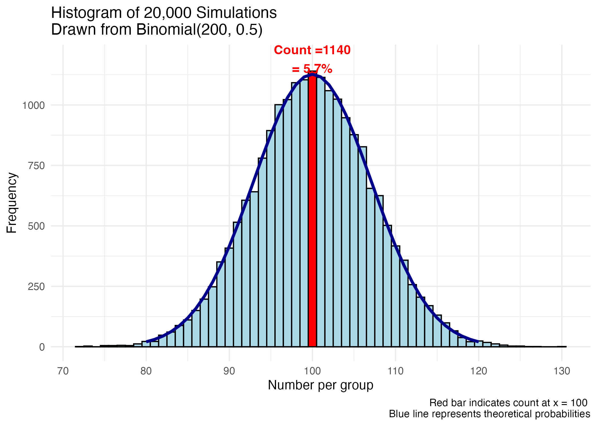
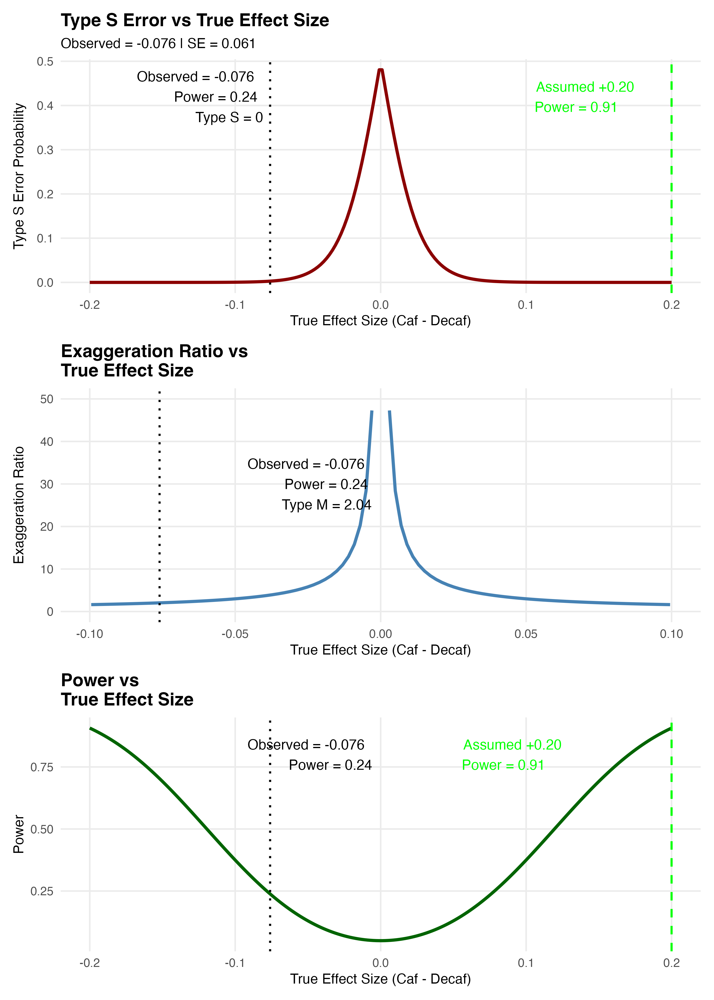

```{r load_packages, message=FALSE, warning=FALSE}
# load required packages
suppressPackageStartupMessages({
  library(brms)        # Bayesian GLMs via Stan
  library(cmdstanr)    # backend for brms
  library(posterior)   # tidy posterior draws
  library(bayesplot)   # PPC & MCMC visualization
  library(ggplot2)
  library(scales)  
  library(tidybayes)   # for bayesian plotting / functions
  library(bridgesampling)
  library(knitr)
  library(rstanarm)
  library(readr)
  library(dplyr)
  library(tidyr)
  library(survival)
  library(survminer)
  library(IPDfromKM)
})

# Use cmdstanr backend (faster, fewer divergences)
cmdstanr::set_cmdstan_path()
options(mc.cores = max(1, parallel::detectCores() - 1))

suppressMessages(cmdstanr::set_cmdstan_path())


# Optional: make figures a bit crisper
bayesplot::color_scheme_set("teal")

# suppress brms startup messages

#| label: quiet-brms-helpers
#| include: false

`%||%` <- function(x, y) if (!is.null(x)) x else y

quiet_brms <- function(...,
                       backend_args = NULL,
                       quiet = TRUE,
                       noisy_on_error = TRUE,
                       debug = getOption("quiet_brms.debug", FALSE)) {
  # Merge backend_args with a 'quiet' flag (caller args win)
  backend_args <- utils::modifyList(list(quiet = quiet), backend_args %||% list())
  
  run <- function(q) {
    # Rebuild backend_args with desired quiet setting for this run
    ba <- utils::modifyList(backend_args, list(quiet = q))
    brms::brm(..., backend = "cmdstanr", backend_args = ba)
  }
  
  # If user forces debug, run noisily and return (shows full compiler output)
  if (isTRUE(debug)) {
    message("[quiet_brms] Debug mode: running noisily.")
    return(run(FALSE))
  }
  
  # Try a quiet run, suppressing R warnings/messages (compiler output minimized by quiet=TRUE)
  fit <- NULL
  err <- NULL
  fit <- try(
    suppressWarnings(
      suppressMessages(
        run(TRUE)
      )
    ),
    silent = TRUE
  )
  
  if (inherits(fit, "try-error")) {
    if (isTRUE(noisy_on_error)) {
      # Surface the *real* cause: re-run noisily so cmdstanr/clang++ errors are printed
      message("\n[quiet_brms] Quiet run failed. Re-running noisily to show the compiler error...\n")
      return(run(FALSE))  # If this errors, you will see the full compiler/Stan error
    } else {
      stop(attr(fit, "condition") %||% fit)
    }
  }
  
  fit
}

quiet_brms <- function(...) {
  model <- NULL
  invisible(capture.output({
    model <- brm(...)
  }))
  return(model)
}


#| label: setup-defaults
#| include: false
# Hide code everywhere by default
knitr::opts_chunk$set(echo = FALSE, warning = FALSE, message = FALSE)

# Re-enable code ONLY for HTML output (so HTML keeps code-fold etc.)
if (knitr::is_html_output()) {
  knitr::opts_chunk$set(echo = TRUE)
}


```


## Backgound

A recent paper, ["Caffeinated Coffee Consumption or Abstinence to Reduce Atrial Fibrillation The DECAF Randomized Clinical Trial"](https://jamanetwork.com/journals/jama/fullarticle/2841253)[@RN1] published online in JAMA on Nov 9 2025 concluded

> "In this clinical trial of coffee drinkers after successful cardioversion, allocation to consumption of caffeinated coffee averaging 1 cup a day was associated with less recurrence of AF or atrial flutter compared with abstinence from coffee and caffeinated products."\

This conclusion is likely surprising to most physicians as the historical belief is that caffeine is associated with increased cardiac ectopy.
However the authors make the case that while 

> "Caffeinated coffee has traditionally been considered proarrhythmic"

its role in atrial fibrillation is less uncertain. Supporting this uncertainty, the authors refer to a previous randomized trial[@RN3] that was not of atrial fibrillation patients but rather of 100 ambulatory patients studies in a crossover design.
That study concluded

> " the consumption of caffeinated coffee did not result in significantly more daily premature atrial contractions than the avoidance of caffeine"

This small trial[@RN3] examined only short-term surrogate endpoints, not atrial fibrillation outcomes, and actually found a non significant trend towards more atrial ectopy in the caffeine group.      

> "The consumption of caffeinated coffee was associated with 58 daily premature atrial contractions as compared with 53 daily events on days when caffeine was avoided (rate ratio, 1.09; 95% confidence interval [CI], 0.98 to 1.20; P=0.10). The consumption of caffeinated coffee as compared with no caffeine consumption was associated with 154 and 102 daily premature ventricular contractions, respectively (rate ratio, 1.51; 95% CI, 1.18 to 1.94)."[@RN3]


Apart from assuming that atrial ectopy is a good surrogate for atrial fibrillation, this suggests confusion between "absence of evidence" with "evidence of absence".    

The DECAF authors[@RN1] also cite a meta-analysis of 12 observational studies[@RN4] that reported no conclusive evidence for or against an association between caffeine intake and incident atrial fibrillation (OR 0.95 (0.84–1.06). The quality of these 12 studies was not reported and as the DECAF authors state 

> "observational studies are prone to confounding,and whether these findings are biased by systematic differences between coffee and noncoffee drinkers is unclear"[@RN1]    

Given this uncertainty, DECAF[@RN1] was designed to investigate the effect of caffeinated coffee consumption versus abstinence on atrial fibrillation recurrence following successful cardioversion. 

## DECAF Trial Design 

DECAF[@RN1] was a randomized controlled trial of 200 regular coffee drinkers with a recent successful cardioversion for atrial fibrillation (AF). Patients were randomized to either continue their usual caffeinated coffee consumption (median 1 cup/day) or to abstain from all caffeine products (decaf group). The primary outcome was recurrence of atrial fibrillation or atrial flutter within 6 months. The sample size calculations were based on assuming     

> "... a 50% incidence of AF recurrence within 6 months following cardioversion. A clinically relevant effect size was assumed to approximate the effectiveness of commonly prescribed antiarrhythmic drugs for recurrentAFafter cardioversion. To provide 80% power
to detect a minimum 41% reduced relative hazard of AF, we enrolled 200 patients (100 per group) assuming a 1:1 randomization scheme, potential 10% loss to follow-up, and .05 2-tailed α level."[@RN1]     

This description is problematic for the following reasons.       
1. The implication is, since the methods section is written before any results are available, that 1:1 randomization of 200 subjects will automatically produce two equal groups. Based on binomial probability theory, there is only a 5.7% chance of achieving a perfectly balanced split (see Figure below).  


```{r fig_binom, fig.cap="Distribution of group sizes for n=200 randomized 1:1 into two groups. The probability of a perfect 100/100 split is only 5.7%.", fig.align="center", fig.width=14, fig.height=7, eval=FALSE}

set.seed(123)
nrand <- rbinom(20000, 200, 0.5)
df <- data.frame(nrand = nrand)

# Count for x = 100
count_100 <- sum(nrand == 100)

# Theoretical probabilities for overlay
x_vals <- 80:120
theoretical <- data.frame(
  x = x_vals,
  prob = dbinom(x_vals, size = 200, prob = 0.5) * 20000
)

gg1 <- ggplot(df, aes(x = nrand, fill = nrand == 100)) +
  geom_histogram(binwidth = 1, color = "black") +
  scale_fill_manual(values = c("TRUE" = "red", "FALSE" = "lightblue")) +
  geom_line(data = theoretical, aes(x = x, y = prob),
            color = "darkblue", linewidth = 1.2, inherit.aes = FALSE) +
  annotate("text", x = 100, y = count_100 + 50,
           label = paste("Count =", count_100, "\n= ", round((count_100 / 20000) * 100, 2), "%", sep = ""),
           color = "red", fontface = "bold") +
  labs(
    title = "Histogram of 20,000 Simulations \nDrawn from Binomial(200, 0.5)",
    x = "Number per group",
    y = "Frequency",
    caption = "Red bar indicates count at x = 100 \nBlue line represents theoretical probabilities"
  ) +
  theme_minimal() +
  theme(legend.position = "none")

print(gg1)
ggsave("output/binom_group_sizes.png", gg1, width = 7, height = 5, dpi = 300)

```
  


```{r binom-group, echo=FALSE, fig.cap='Histogram of 20,000 simulations drawn from Binomical (200, 0.5)', out.width='600px', fig.align='center'}

```
 
2. Given the prevailing prior uncertainty, designing a trial to detect a very large risk reduction is overly optimistic. The 80% power estimate assumed a 41% reduction applied to a 50% baseline rates, meaning the intervention is expected to reduce recurrence by an absolute 20.5%. What would be the power with this sample size of 200 to detect a more modest relative risk reduction, say 15% (i.e. from 50% to 42.5%)? The answer is 24% (see Figure below, left panel), illustrating the study was severely underpowered to detect more realistic effect sizes and therefore at risk of Type M (magnitude) error[@RN38], meaning  any statistically significant result tends to exaggerate the true effect[@RN38]. Thus the observed −17% risk difference may be overstating the true benefit, possibly by a factor of two (see right panel of above Figure). The published result should therefore be interpreted cautiously. Further exploration of the probability of a clinically meaningful result awaits the Bayesian analysis provided in later sections.

```{r power_curve,  fig.cap="Power curves for DECAF trial (n=200) to detect various relative risk reductions from a 50% baseline recurrence rate. The design has only 24% power to detect a 15% relative risk reduction(RRR). If the true effect is a 15% RRR, it is likely that any statistically significant result from this underpowered study will overstate the true effect by about two-fold.", fig.align="center", fig.width=14, fig.height=7, eval=FALSE}

# ----------------------------------------
# Required packages
# ----------------------------------------
library(retrodesign)
library(ggplot2)
library(patchwork)

# ----------------------------------------
# Calculate SE from observed effect and CrI
# ----------------------------------------
observed_effect <- -0.076     # Observed RD (Caf - Decaf)
lower <- -0.195               # Lower bound of 95% CrI
upper <- 0.044                # Upper bound of 95% CrI

# Approximate SE from 95% CrI
se <- (upper - lower) / (2 * 1.96)

# z-score and p-value (frequentist approximation)
z <- observed_effect / se
p_value <- 2 * (1 - pnorm(abs(z)))

# ----------------------------------------
# Assumed effect from original design
# ----------------------------------------
assumed_effect <- 0.20  # DECAF assumed a large benefit for decaf

# ----------------------------------------
# Compute retrodesign metrics for observed and assumed effects
# ----------------------------------------
retro_observed <- retro_design_closed_form(observed_effect, se)
retro_assumed <- retro_design_closed_form(assumed_effect, se)

power_observed <- retro_observed$power
power_assumed <- retro_assumed$power
type_s_observed <- retro_observed$type_s
type_m_observed <- retro_observed$type_m

# ----------------------------------------
# Print numeric summary
# ----------------------------------------
# cat("Observed Effect =", observed_effect, "\n")
# cat("SE =", round(se, 4), "\n")
# cat("Approx p-value =", round(p_value, 4), "\n")
# cat("Power (Observed) =", round(power_observed, 3), "\n")
# cat("Type S Error =", round(type_s_observed, 3), "\n")
# cat("Type M Error =", round(type_m_observed, 3), "\n\n")
# cat("Assumed Effect =", assumed_effect, "\n")
# cat("Power (Assumed) =", round(power_assumed, 3), "\n\n")


# ----------------------------------------
# Range of true effects for plotting
# ----------------------------------------
true_effects <- seq(-0.20, 0.20, length.out = 200)
retro <- retro_design_closed_form(true_effects, se)

# Build data frame
df <- data.frame(
  TrueEffect = true_effects,
  Power = retro$power,
  TypeS = retro$type_s,
  Exaggeration = retro$type_m
)

# ----------------------------------------
# Custom theme for polished look
# ----------------------------------------
custom_theme <- theme_minimal(base_size = 16) +
  theme(
    plot.title = element_text(face = "bold", size = 18),
    plot.subtitle = element_text(size = 14),
    axis.title = element_text(size = 14),
    axis.text = element_text(size = 12),
    panel.grid.minor = element_blank()
  )

# ----------------------------------------
# Panel 1: Type S Error
# ----------------------------------------
p1 <- ggplot(df, aes(x = TrueEffect, y = TypeS)) +
  geom_line(color = "darkred", size = 1.5) +
  geom_vline(xintercept = assumed_effect, linetype = "dashed", color = "green", linewidth = 1) +
  geom_vline(xintercept = observed_effect, linetype = "dotted", color = "black", linewidth = 1) +
  annotate("text", x = .1, y = 0.42,
           label = paste("Assumed +0.20\nPower =", round(power_assumed, 2)),
           color = "green", hjust = -0.1, size = 5) +
  annotate("text", x = observed_effect, y = 0.42,
           label = paste("Observed =", observed_effect,
                         "\nPower =", round(power_observed, 2),
                         "\nType S =", round(type_s_observed, 2)),
           color = "black", hjust = 1.1, size = 5) +
  labs(title = "Type S Error vs True Effect Size",
       subtitle = paste("Observed =", observed_effect, "| SE =", round(se, 4)),
       x = "True Effect Size (Caf - Decaf)",
       y = "Type S Error Probability") +
  custom_theme

# ----------------------------------------
# Panel 2: Exaggeration Ratio
# ----------------------------------------
p2 <- ggplot(df, aes(x = TrueEffect, y = Exaggeration)) +
  geom_line(color = "steelblue", size = 1.5) +
  geom_vline(xintercept = assumed_effect, linetype = "dashed", color = "green", size = 1) +
  geom_vline(xintercept = observed_effect, linetype = "dotted", color = "black", size = 1) +
  annotate("text", x = .1, y = max(df$Exaggeration)*0.85,
           label = paste("Assumed +0.20\nPower =", round(power_assumed, 2)),
           color = "green", hjust = -0.1, size = 5) +
  annotate("text", x = 0, y = 30,
           label = paste("Observed =", observed_effect,
                         "\nPower =", round(power_observed, 2),
                         "\nType M =", round(type_m_observed, 2)),
           color = "black", hjust = 1.1, size = 5) +
  xlim(-0.10, 0.10) +
  ylim(0,50) +
  labs(title = "Exaggeration Ratio vs \nTrue Effect Size",
       x = "True Effect Size (Caf - Decaf)",
       y = "Exaggeration Ratio") +
  custom_theme

# ----------------------------------------
# Panel 3: Power
# ----------------------------------------
p3 <- ggplot(df, aes(x = TrueEffect, y = Power)) +
  geom_line(color = "darkgreen", size = 1.5) +
  geom_vline(xintercept = assumed_effect, linetype = "dashed", color = "green", size = 1) +
  geom_vline(xintercept = observed_effect, linetype = "dotted", color = "black", size = 1) +
  annotate("text", x = .05, y = 0.8,
           label = paste("Assumed +0.20\nPower =", round(power_assumed, 2)),
           color = "green", hjust = -0.1, size = 5) +
  annotate("text", x = 0, y = 0.8,
           label = paste("Observed =", observed_effect,
                         "\nPower =", round(power_observed, 2)),
           color = "black", hjust = 1.1, size = 5) +
  labs(title = "Power vs \nTrue Effect Size",
       x = "True Effect Size (Caf - Decaf)",
       y = "Power") +
  custom_theme

# ----------------------------------------
# Save combined plots
# ----------------------------------------

combined_plot <- p1 / p2 / p3
combined_plotMP <- p3 + p2
ggsave("output/decaf_retrodesign_panels_polished.png", combined_plot, width = 10, height = 14, dpi = 300)

combined_plotMP
```


```{r histo, echo=FALSE, fig.cap='Histogram of 20,000 simulations drawn from Binomical (200, 0.5)', out.width='600px', fig.align='center'}

```

3. A lack of specification as to which arm (abstinence or caffeinated) is hypothesized to have the reduced risk. This ambiguity creates interpretive flexibility as whichever arm shows benefit could be claimed as success.  Such directional absence hinders inference and inflates the risk of misleading conclusions.  This lack of statistical clarity is evident not only in the published article but also in the [trial protocol](https://cdn.jamanetwork.com/ama/content_public/journal/jama/0/joi250099supp1_prod_1762458119.41086.pdf?Expires=1766002960&Signature=veUO2luJ-u-d2v~RtBHqQYJC2JetjhjFXQ2J-Eyc49InJ9BYIPTzVjFxE7oZF7BTlAN7g8~HXiemM2Oh5AbgAaVaInX2CpjN0TujOBrJmE5uc4HCUffwRztEF3x-I7X3m5j8a2cvoGbjfqEIHXGVgY95WpCLsV4H~3Xbiorj-Q1imZOtOl3~q9qwYSifSymwWG1CyjaGrBo8RF8zpCVo7pdZY1eTv2kh9Q-9I5ysrMIgnlLCmT5OcOYdVYt2i1nkzqOpMg9m7DU62l68iAOeP5r-7-towaGgMkpsGHv1qAID4JMgcv4J1ql~DJQlpkMKvALXpRUBbdUAZs6DXRn~9A__&Key-Pair-Id=APKAIE5G5CRDK6RD3PGA) and  trial registration documentation at [ClinicalTrials.gov](https://clinicaltrials.gov/study/NCT05121519#study-plan). It is disconcerting that these design issues were overlooked not only by the authors but also apparently by peer reviewers, journal editors, and national funding agencies. These design flaws contribute to uncertainty in interpreting the final results.

## DECAF Trial Results

In the caffeinated coffee group, 47% of patients  had an AF or atrial flutter recurrence compared to 64% recurrence in the decaf group (hazard ratio, 0.61 [95%CI, 0.42-0.89],). The authors concluded 

> "...allocation to consumption of caffeinated coffee averaging 1 cup a day was
[**associated**]{.red-text} with less recurrence of AF or atrial flutter compared with abstinence from coffee and caffeinated products."[@RN1]

Given the randomized design and the statistically significant result (p = 0.01), it is surprising that the conclusion wasn't 

> > ...allocation to consumption of caffeinated coffee averaging 1 cup a day 
[**caused**]{.red-text} less recurrence of AF or atrial flutter compared with abstinence from coffee and caffeinated products.

The results were summarized in the Figure below.    

![Cumulative incidence curve from DECAF trial[@RN1] showing higher recurrence rates in the decaf group (blue) versus caffeinated group (orange).](input/decaf_CI_plot.png){fig-align="center" fig-height="400"}

```{r raw_data, eval=FALSE}
# Observed data

a_success <- 64  # decaf group
a_total <- 100
b_success <- 47  # caffeinated group
b_total <- 100

# Proportions
p1 <- a_success / a_total
p2 <- b_success / b_total

# Risk Difference
rd <- p1 - p2

# Standard error for RD
se_rd <- sqrt((p1 * (1 - p1) / a_total) + (p2 * (1 - p2) / b_total))

# 95% CI
z <- 1.96
ci_low <- rd - z * se_rd
ci_high <- rd + z * se_rd
p <- 2 * (1 - pnorm(abs(rd / se_rd)))

# Print results
# cat("Risk Difference (RD):", round(rd * 100, 2), "%\n")
# cat("95% CI:", round(ci_low * 100, 2), "% to", round(ci_high * 100, 2), "%\n")
```


## Bayesian reanalysis of DECAF (survival modeling)

The small p-value (p(data|null hypothesis) informs us that observing this data or more extreme data, if there was no true effect is unlikely. The inverse probability (p(effect|data) is arguably of greater interest and provides additional insights, most importantly the ability to include prior knowledge and to provide probability estimates of benefit or harm. Inverse probability, or Bayesian analyses, of survival data requires individual patient data (IPD) and well justified priors, which summarize the state of knowledge before seeing the data. Priors are often deemed the Achilles' heel of Bayesian analyses, but well justified, transparent and robust testing of different priors can mitigate subjectiveness concerns. In Bayesian reanalyses of completed studies, prior beliefs can sometimes be extracted from the original power calculations. For example, the DECAF[@RN1] authors assumed a baseline recurrence risk of 50% with a 41% relative risk reduction and therefore a 29.5% risk in the intervention group (0.50 - 0.50*0.41 = 0.295). However we are now faced with the previous identification problem of the direction in the projected improvement. Did DECAF[@RN1] authors believe that the risk reduction would be with decaffeinated or caffeinated exposure? Given the prevailing belief of caffeine as a proarrhythmic agent and given that the study population was comprised initially of coffee drinkers, with the intervention being abstinence we assume the proposed relative risk reduction is in favor of the decaffeinated group.

```{r load_data, eval=FALSE}
agg2 <- data.frame(
  group = factor(c("caffeinated", "abstinence"),
                 levels = c("abstinence", "caffeinated")),  # reference first
  y     = c(47, 64),
  n     = c(100, 100)
)
stopifnot(all(levels(agg2$group) == c("abstinence","caffeinated")))

# Observed counts by group (named vector) — used later to align PPCs
y_obs_by_group <- with(agg2, setNames(y, as.character(group)))
```

```{r prior_construction, eval=FALSE}
# ------------------------------------------------------------
# PRIOR CONSTRUCTION BASED ON DECAF PUBLICATION
# Since with use binomial model with logit link, we need to convert
# the RR-based prior into log-OR scale for class="b" and 
# logit scale for class="Intercept"
# ------------------------------------------------------------
# 1: Decaf (reference) reduces risk by 41% vs caffeinated.
RR_decaf_vs_caff <- 0.59  # 1- RRR = 1 - 0.41 = 0.59

# 2: Baseline risk you want to anchor is caffeinated = 0.50.
p_caff_baseline  <- 0.50

# Function to convert probabilities to odds ratio to logOR 
# Given RR(decaf vs caff) and p_caff, compute p_decaf, OR(caff vs decaf), 
# logOR(caff vs decaf), and Intercept mean = logit(p_decaf).
from_RR_and_p_caff <- function(RR_decaf_vs_caff, p_caff) {
  stopifnot(RR_decaf_vs_caff > 0, p_caff > 0, p_caff < 1)
  p_decaf <- RR_decaf_vs_caff * p_caff  # decaf risk = RR * caffeinated risk
  if (p_decaf <= 0 || p_decaf >= 1) {
    warning(sprintf("Implied p_decaf = %.3f outside (0,1). Adjust RR or p_caff.", p_decaf))
  }
  odds_caff  <- p_caff  / (1 - p_caff)
  odds_decaf <- p_decaf / (1 - p_decaf)
  OR_caff_vs_decaf   <- odds_caff / odds_decaf
  logOR_caff_vs_decaf<- log(OR_caff_vs_decaf)
  mu_intercept       <- qlogis(p_decaf)       # baseline (decaf) on logit scale
  list(
    p_caff       = p_caff,
    p_decaf      = p_decaf,
    OR           = OR_caff_vs_decaf,
    logOR        = logOR_caff_vs_decaf,  # prior mean for class="b"
    mu_intercept = mu_intercept          # prior mean for class="Intercept"
  )
}

conv <- from_RR_and_p_caff(RR_decaf_vs_caff, p_caff_baseline)
mu_b <- conv$logOR  # prior mean for b_groupcaffeinated (log-OR: caff vs decaf) ≈ +0.871
mu_intercept <- conv$mu_intercept # prior mean for Intercept = logit(p_decaf) ≈ -0.871
p_decaf_prior_center <- plogis(mu_intercept)

# message(sprintf("Prior centers: logOR_b ≈ %.3f (OR ≈ %.2f), Intercept ≈ %.3f => p_decaf ≈ %.3f",  mu_b, exp(mu_b), mu_intercept, p_decaf_prior_center))

# Prior SDs: tune to reflect how strongly you want to encode the belief.
sd_b <- 0.5          # narrower = stronger prior on treatment effect
sd_intercept <- 1.5  # weakly-informative baseline for decaf

priors <- c(
  set_prior(sprintf("normal(%g, %g)", mu_b,         sd_b),         class = "b"),
  set_prior(sprintf("normal(%g, %g)", mu_intercept, sd_intercept), class = "Intercept")
)

# alternative prior
#priors <- c(set_prior(paste0("normal(", mu_b, ", ", sd_b, ")"),
#            class = "b", coef = "groupcaffeinated"),
# set_prior(paste0("normal(", mu_intercept, ", ", sd_intercept, ")"), class =  "Intercept"))
```

The priors for both treatment effect and baseline risk can be specified as normal distributions on the log-odds scale. Based on the assumptions used by the DECAF investigators, the distributional parameters for the baseline control prior will be mean centered at their belief of a 50% recurrence risk (0 on the logit scale) with a standard deviation of 1.5, indicating a weakly informative prior. Similarly, the prior for the treatment effect will be centered at 29.5% (-0.871 on the logit scale) with an assumed standard deviation of 0.5, reflecting slightly higher confidence in our ability to estimate effect size variability. The reasonableness of these priors can be assessed through prior predictive checks which demonstrates that these priors adequately reflect the DECAF position of considerable uncertainty with a wide range of possible effect sizes, principally with expected benefit (93.5% probability), but a small probability of harm, for the intervention versus control.


```{r prior_predictive_checks, eval=FALSE}
library(ggplot2)
library(dplyr)
library(scales)

# ======================================================
# Prior predictive for a two-arm Binomial trial
# and effect-measure plots with requested axis settings
# ======================================================


# -----------------------------
# 1) Prior specification (EDIT)
# -----------------------------
# Baseline (control) log-odds prior: theta0 ~ Normal(mu0, sd0^2)
mu0 <- 0.0       # logit(0.50) = 0
sd0 <- 1.5       # weakly-informative baseline prior

# Treatment effect prior on log-odds ratio: delta ~ Normal(mud, sdd^2)
mud <- -0.871    # ≈ logit(0.295) - logit(0.50), belief of ~29.5% at 50% baseline
sdd <- 0.5       # moderately informative

# Planned sample sizes (EDIT as needed)
nC <- 150
nT <- 150

# Number of prior draws (increase for smoother densities)
S <- 100000
set.seed(1)

# -----------------------------
# 2) Simulate from the priors
# -----------------------------
logistic <- function(x) 1 / (1 + exp(-x))

theta0 <- rnorm(S, mean = mu0, sd = sd0)   # baseline log-odds
delta  <- rnorm(S, mean = mud, sd = sdd)   # treatment log-OR

pC <- logistic(theta0)          # true control probability
pT <- logistic(theta0 + delta)  # true treatment probability

# -----------------------------
# 3) Prior predictive data
# -----------------------------
YC <- rbinom(S, size = nC, prob = pC)
YT <- rbinom(S, size = nT, prob = pT)

hat_pC <- YC / nC
hat_pT <- YT / nT

# -----------------------------
# 4) Effect measures
# -----------------------------
# Risk difference: RD = p_hat_T - p_hat_C (benefit shows as negative)
RD <- hat_pT - hat_pC

# Risk ratio
eps <- 1e-12
RR <- (hat_pT + eps) / (hat_pC + eps)

# Odds ratio
OR <- ((hat_pT + eps) / (1 - hat_pT + eps)) /
  ((hat_pC + eps) / (1 - hat_pC + eps))

logRR <- log(RR)
logOR <- log(OR)

# ---------------------------
# log(OR): x in [-3, +1]
# ---------------------------
p_logOR <- ggplot(data.frame(x = logOR), aes(x = x)) +
  geom_density(fill = "#9ECAE1", color = "#3182BD", alpha = 0.3, adjust = 1.0) +
  geom_vline(xintercept = 0, linetype = "dashed", color = "grey40") +
  coord_cartesian(xlim = c(-3, 1)) +
  labs(
    title = "Prior Predictive: log Odds ratio",
    x = "log(OR)", y = "Density"
  ) +
  theme_minimal(base_size = 12)


# ---------------------------
# log(RR): x in [-3, +1]
# ---------------------------
p_logRR <- ggplot(data.frame(x = logRR), aes(x = x)) +
  geom_density(fill = "#CFE8B9", color = "#31A354", alpha = 0.3, adjust = 1.0) +
  geom_vline(xintercept = 0, linetype = "dashed", color = "grey40") +
  coord_cartesian(xlim = c(-3, 1)) +
  labs(
    title = "Prior Predictive: log Risk ratio",
    x = "log(RR)", y = "Density"
  ) +
  theme_minimal(base_size = 12)

pr_RD_gt0 <- mean(logRR > 0)
ggsave("output/prior_predictive_logRR.png", width = 6, height = 4, dpi = 300)

# ---------------------------
# Risk difference (p̂T − p̂C), scaled per 100 patients
# ---------------------------

RD100 <- 100 * RD  # keep sign: benefit-negative if pT < pC

# Tail probability for "worse than control" (RD > 0)
pr_RD_gt0 <- mean(RD > 0)

# Density for shading region RD > 0 (i.e., > 0 per 100 after scaling too)
den_RD <- density(RD100, adjust = 1.0, na.rm = TRUE)
df_RD  <- data.frame(x = den_RD$x, y = den_RD$y)

# Reasonable x-limits from central mass; edit if you prefer fixed limits
xlim_rd <- quantile(RD100, c(0.005, 0.995), na.rm = TRUE)

p_RD100 <- ggplot(df_RD, aes(x = x, y = y)) +
  # Shade the >0 side (treatment worse under RD = pT - pC)
  geom_area(data = subset(df_RD, x > 0), fill = "#FDAE6B", alpha = 0.35) +
  # Outline full density
  geom_line(color = "#E6550D", linewidth = 1.0) +
  geom_vline(xintercept = 0, linetype = "dashed", color = "grey40") +
  coord_cartesian(xlim = xlim_rd) +
  labs(
    title = "Prior Predictive: Absolute risk difference",
    subtitle = sprintf("Shaded area: P(RD > 0) = %.3f", pr_RD_gt0),
    x = "Absolute risk difference (per 100 patients)",  # still p̂T − p̂C
    y = "Density"
  ) +
  theme_minimal(base_size = 12)

ggsave("output/prior_predictive_RD100.png", width = 6, height = 4, dpi = 300)

```
   
In addition to the priors, the Bayesian survival analysis requires the individual patient data (IPD). Cumulative incidence data available in graphical format (DECAF[@RN1] Figure3), were extracted with WebPlotDigitizer[@RN7716] and transformed into survival format to generate a Kaplan–Meier (KM) plot using the Guyot et al[@RN5762] algorithm that incorporates numbers at risk and event counts. This method was implemented via the IPDfromK `R` package[@IPDfromKM] providing a robust and validated approach for reconstructing IPD from published survival curves for secondary analyses. The success in extracting the IPD is evident in the complete overlap between the reconstructed KM curves and the original published curves (see Figure below).

```{r cumulative, eval=FALSE, fig.cap="Cumulative incidence plots from digitalized DECAF curves and reconstructed KM plots. Note excellent comparison with Figure 3. ", fig.align="center", fig.width=6, fig.height=4}
# ================== 1) Read & tidy your CSV ==================

df <- read_csv("input/decaf_incident_data.csv",
               col_names = c("coffee_time","coffee_inc","decaf_time","decaf_inc"),
               skip = 2, show_col_types = FALSE)

coffee_xy <- df %>% filter(!is.na(coffee_time) & !is.na(coffee_inc)) %>%
  transmute(time = coffee_time, inc = coffee_inc) %>%
  arrange(time) %>% distinct(time, .keep_all = TRUE)

decaf_xy  <- df %>% filter(!is.na(decaf_time)  & !is.na(decaf_inc)) %>%
  transmute(time = decaf_time,  inc = decaf_inc)  %>%
  arrange(time) %>% distinct(time, .keep_all = TRUE)

# Truncate raw digitized series at 180 days 
coffee_xy <- coffee_xy %>% filter(time <= 180)
decaf_xy  <- decaf_xy  %>% filter(time <= 180)

# ================== 2) Incidence(%) -> Survival(%) for reconstruction ==================
coffee_km <- coffee_xy %>% transmute(time, surv = pmax(0, 100 - inc))
decaf_km  <- decaf_xy  %>% transmute(time, surv = pmax(0, 100 - inc))
if (min(coffee_km$time) > 0) coffee_km <- bind_rows(tibble(time = 0, surv = 100), coffee_km)
if (min(decaf_km$time)  > 0) decaf_km  <- bind_rows(tibble(time = 0, surv = 100),  decaf_km)

# ================== 3) At-risk tables (yours) ==================
trisk <- c(0, 30, 60, 90, 120, 150, 180)
nrisk_coffee <- c(100, 79, 70, 61, 57, 56, 52)
nrisk_decaf  <- c(100, 64, 53, 47, 45, 38, 36)

# ================== 4) Reconstruct IPD (Guyot method via IPDfromKM) ==================

prep_coffee <- preprocess(as.matrix(coffee_km), trisk = trisk, nrisk = nrisk_coffee, maxy = 100)
prep_decaf  <- preprocess(as.matrix(decaf_km),  trisk = trisk, nrisk = nrisk_decaf,  maxy = 100)

ipd_coffee <- getIPD(prep_coffee, armID = 1)$IPD  # coffee arm
ipd_decaf  <- getIPD(prep_decaf,  armID = 0)$IPD  # decaf arm

ipd <- bind_rows(
  data.frame(time = ipd_coffee$time, status = ipd_coffee$status, arm_coffee = 1L),
  data.frame(time = ipd_decaf$time,  status = ipd_decaf$status,  arm_coffee = 0L)
)

# ================== 5) Truncate ANALYSIS at 180 days ==================
ipd <- ipd %>%
  mutate(time_orig = time, status_orig = status,
         time = pmin(time, 180),
         status = ifelse(time_orig > 180, 0L, status_orig)) %>%
  select(-time_orig, -status_orig)

# ================== 6) Frequentist Cox (authors’ coding: coffee=1, decaf=0) ==================
fit_cox <- coxph(Surv(time, status) ~ arm_coffee, data = ipd)
s_cox   <- summary(fit_cox)
hr      <- exp(coef(fit_cox)["arm_coffee"])
ci_95   <- exp(confint(fit_cox)["arm_coffee", ])
p_value <- s_cox$coefficients["arm_coffee", "Pr(>|z|)"]
# cat(sprintf("\nFrequentist Cox (coffee vs decaf): HR = %.2f (95%% CI %.2f–%.2f); p = %.3f\n", hr, ci_95[1], ci_95[2], p_value))

# ================== 7) KM plot (truncated at 180 days) ==================
km_fit <- survfit(Surv(time, status) ~ arm_coffee, data = ipd)
p_km <- ggsurvplot(
  km_fit, data = ipd, conf.int = FALSE, risk.table = TRUE,
  xlim = c(0, 180),
  legend.labs = c("Decaf (control)", "Coffee (intervention)"),
  legend.title = "", palette = c("#D95F02","#1B9E77")
)

ggsave("output/km_plot_coffee_vs_decaf.png", p_km$plot, width = 7, height = 5, dpi = 300)

# ================== 8) Cumulative incidence overlay: digitized vs reconstructed ==================
# Reconstructed cumulative incidence from KM (in %)
km_df <- survminer::surv_summary(km_fit) %>%
  mutate(cuminc = 100 * (1 - surv),
         arm = ifelse(strata == "arm_coffee=0", "Decaf (KM)", "Coffee (KM)")) %>%
  select(time, cuminc, arm)

# Digitized cumulative incidence (already in %), labeled
dig_df <- bind_rows(
  coffee_xy %>% transmute(time, cuminc = inc, arm = "Coffee (digitized)"),
  decaf_xy  %>% transmute(time, cuminc = inc, arm = "Decaf (digitized)")
)

p_ci <- ggplot() +
  geom_step(data = km_df, aes(x = time, y = cuminc, color = arm), linewidth = 1) +
  geom_line(data = dig_df, aes(x = time, y = cuminc, color = arm), linetype = "dashed") +
  scale_color_manual(values = c("Coffee (KM)"="#1B9E77","Decaf (KM)"="#D95F02",
                                "Coffee (digitized)"="#1B9E77","Decaf (digitized)"="#D95F02")) +
  coord_cartesian(xlim = c(0,180), ylim = c(0,100)) +
  labs(title = "Cumulative incidence (reconstructed KM vs digitized points)",
       x = "Days", y = "Cumulative incidence (%)",
       color = NULL) +
  scale_x_continuous(breaks = c(30, 60, 90, 120, 150, 180)) +
  scale_y_continuous(breaks = c(20, 40, 60, 80, 100)) +
  theme_minimal(base_size = 12) +
  theme(legend.position = "bottom")

ggsave("output/cumulative_incidence_overlay.png", p_ci, width = 7, height = 5, dpi = 300)

```


```{r cumulative_fig, echo=FALSE, fig.cap='Cumulative incidence (reconstructed KM vs digitized points) showing almost perfect concordance', out.width='600px', fig.align='center'}
knitr::include_graphics('output/cumulative_incidence_overlay.png')
```

The IPD calculated frequentist survival analysis results, HR = 0.62 (95% CI 0.43–0.91), p = 0.014, closely matches the published DECAF[@RN1] results, confirming the accuracy of the IPD reconstruction process.

Once the priors and IPD are specified, we can proceed with the Bayesian survival regression modelling. As Cox regression uses the partial likelihood, which cancels out the baseline hazard when estimating the regression coefficients (i.e., log‑HRs), in a Bayesian Cox survival model we only need a prior for the the treatment effect.

```{r eval=FALSE}

#| label: compile-brms
#| message: true
#| warning: true
#| error: true

# ================== 9) Bayesian Cox in brms (coffee vs decaf) ==================
# Prior: belief that decaf is better -> coffee harmful a priori.
# Encode as Normal(+0.871, 0.5) on the coffee coefficient (log-HR).
ipd_brm <- ipd %>% mutate(cens = 1L - status)  # brms uses 1=censored

prior_cox <- c(
  set_prior("normal(0.871, 0.5)", class = "b", coef = "arm_coffee")
)


#| message: false
#| warning: false

fit_brm_cox <- quiet_brms(
  time | cens(cens) ~ arm_coffee,
  data    = ipd_brm,
  family  = cox(),
  prior   = prior_cox,
  backend = "cmdstanr",
  chains  = 4, iter = 2500, warmup = 1000, seed = 20251114,
  refresh = 0, control = list(adapt_delta = 0.999, max_treedepth = 13)
)

# print(fit_brm_cox)

# ---- Finish: summarize posterior HR and a simple probability statement ----
post_cox <- posterior_summary(fit_brm_cox, variable = "b_arm_coffee")
HR_post  <- exp(unlist(post_cox[1, c("Estimate","Q2.5","Q97.5")]))

# cat(sprintf("\nBayesian Cox (coffee vs decaf): HR = %.2f (95%% CrI %.2f–%.2f)\n", HR_post[1], HR_post[2], HR_post[3]))

# Optional: posterior probability that coffee is beneficial (HR < 1)
draws_b <- as_draws_df(fit_brm_cox)[["b_arm_coffee"]]
# cat(sprintf("Pr(HR < 1 | data, prior) = %.3f\n", mean(draws_b < 0)))
```
The Bayesian posterior hazard ratio is 0.74 (95% CrI 0.53–1.04), suggesting that caffeinated coffee consumption may be associated with a lower risk of AF recurrence compared to decaffeinated coffee but the strength of the conclusion has been tempered by the prior belief that decaffeinated and not caffeinated, coffee would be beneficial. Graphically this shift of the observed result by the prior belief is shown in the Figure below. Notice also the width of the posterior probability has narrowed, underscoring that our new data has decreased our uncertainty about the effect of coffee.

```{r logHR, eval=FALSE, fig.cap="Prior and posterior probability density functions of log HR", fig.align="center", fig.width=14, fig.height=7}

library(dplyr)
library(ggplot2)
library(posterior)

# ---- 1) Extract posterior draws of the treatment coefficient from brms Cox ----
# Your model formula was: time | cens(cens) ~ arm_coffee
draws_df <- as_draws_df(fit_brm_cox)

# Robustly locate the coefficient in case the name changes; print names if needed
# print(names(draws_df)[grepl("^b_", names(draws_df))])

stopifnot("b_arm_coffee" %in% names(draws_df))
post_b <- draws_df[["b_arm_coffee"]]   # log-HR for caffeinated (1) vs decaf (0)

# ---- 2) Generate prior draws with same length (coffee harmful a priori) ----
S <- length(post_b)
prior_mu <- +0.871   # your belief: decaf better -> coffee harmful on log-(hazard) scale
prior_sd <- 0.5
prior_b  <- rnorm(S, mean = prior_mu, sd = prior_sd)

# ---- 3) Combine to long format ----
df_b <- bind_rows(
  data.frame(value = prior_b, which = "Prior"),
  data.frame(value = post_b,  which = "Posterior")
)

# ---- 4) Observed value and posterior mean (for vertical lines) ----
x_obs       <- log(0.61)                    # authors' frequentist estimate
post_mean   <- mean(post_b, na.rm = TRUE)   # posterior mean of log-HR
post_meanHR <- exp(post_mean)

# ---- 5) Plot: Prior vs Posterior on log-HR with reference lines ----
p <- ggplot(df_b, aes(x = value, colour = which, fill = which)) +
  geom_density(alpha = 0.15, linewidth = 0.9) +
  geom_vline(xintercept = x_obs, colour = "grey30", linetype = "dashed", linewidth = 0.8) +
  geom_vline(xintercept = post_mean, colour = "#E34A33", linetype = "dotdash", linewidth = 0.9) +
  labs(
    color = NULL, fill = NULL, x = "log-HR (caffeinated vs decaf)",
    y = NULL,
    title = "Prior vs Posterior for log-HR (caffeinated vs decaf)",
    subtitle = sprintf("Observed HR = 0.61 (log = %.3f). Posterior mean HR ≈ %.2f (log = %.3f).",
                       x_obs, post_meanHR, post_mean),
    caption = "DECAF prior +0.871  indicating \n decaffienated risk < coded caffeinated ."
  ) +
  theme_bw() +
  theme(plot.caption = element_text(size = 9))

hr_breaks     <- c(0.4, 0.5, 0.61, 0.75, 1, 1.25, 1.5, 2)
log_hr_breaks <- log(hr_breaks)

p <- p + scale_x_continuous(
      name = "log-HR (caffeinated vs decaf)",
      sec.axis = sec_axis(~ ., breaks = log_hr_breaks, labels = hr_breaks,
                          name = "Hazard ratio (caffeinated vs decaf)")
    )
ggsave("output/prior_vs_posterior_logHR.png", p, width = 7, height = 5, dpi = 300)


# ---- 6) Probability coffee has clinically meaningful benefit (HR < 0.9) ----


p_hr_lt_0_9 <- df_b %>%
  filter(which == "Posterior") %>%
  summarise(prob = mean(value < log(0.9), na.rm = TRUE)) %>%
  pull(prob)

# sprintf("%.3f", p_hr_lt_0_9)
# round(p_hr_lt_0_9, 3)

```


```{r logHR_fig, echo=FALSE, fig.cap='Prior vs Posterior for log-HR (caffeinated vs decaf)', out.width='600px', fig.align='center'}
knitr::include_graphics('output/prior_vs_posterior_logHR.png')
```

Despite this shift, the posterior probability remains high that caffeinated coffee has a beneficial effect (HR < 1) is 96%. However, the probability that caffeinated coffee has a clinically meaningful benefit, for example a HR < 0.9, falls to 88%. Increasing the threshold of what represents a clinically meaningful decrease, will lead to a corresponding reduction in the probability of a beneficial caffeine effect. 


## Bayesian reanalysis of DECAF (risk difference)

 
```{r model_fitting_rd, cache=TRUE, eval=FALSE}

library(brms)
library(ggplot2)
library(ggtext)   # <- for colored text in subtitle

# ---- Priors ----
mu0 <- 0.0      # baseline log-odds
sd0 <- 1.5
mud <- -0.871   # mean of prior for log-OR (caffeinated vs decaf) on logit scale
sdd <- 0.5
set.seed(1234)

# ---- Fit Bayesian binomial model ----
# The model will be run with 4 chains, each with 4000 iterations (1000 warmup), and using the `cmdstanr` backend for efficient sampling. The `adapt_delta` control parameter is set to 0.95 to help ensure convergence. 

fit_binom2 <- quiet_brms(
  formula = y | trials(n) ~ group, # groupcaffeinated is log-OR(caff vs decaf)
  data = agg2,
  family = binomial(link = "logit"),
  prior = priors,
  chains = 4,
  iter = 4000,
  warmup = 1000,
  refresh = 0,
  backend = "cmdstanr",
  control = list(adapt_delta = 0.95)
)
# print(summary(fit_binom2), digits = 3)


# ---- Posterior RD (caffeinated − decaffeinated) ----
nd <- data.frame(group = c("abstinence", "caffeinated"), n = c(100, 100))
eta_post <- posterior_linpred(fit_binom2, newdata = nd, transform = FALSE)
p_post   <- plogis(eta_post)
rd_post  <- p_post[, 2] - p_post[, 1]  # caffeinated − decaffeinated

post_mean <- mean(rd_post)
post_sd <- sd(rd_post)
post_ci   <- quantile(rd_post, c(0.025, 0.975))
# pnorm((0 - post_mean) / post_sd)  # Pr(RD < 0 | data, prior) AKA pnorm(0, post_mean, post_sd) 
# clinically significant threshold at RD = -0.02
# pnorm((-0.02 - post_mean) / post_sd)  # Pr(R

# ---- Observed RD (same direction: caffeinated − decaffeinated) ----
obs <- aggregate(cbind(y, n) ~ group, data = fit_binom2$data, sum)
obs <- obs[match(c("abstinence", "caffeinated"), obs$group), ]
obs_rd <- obs$y[2] / obs$n[2] - obs$y[1] / obs$n[1]

# ---- Prior RD (centered > 0 for this RD definition) ----
theta0  <- rnorm(length(rd_post), mu0, sd0)   # baseline (decaf) log-odds
delta   <- rnorm(length(rd_post), mud, sdd)   # log-OR (caffeinated vs decaf)
p_decaf <- plogis(theta0)
p_caff  <- plogis(theta0 + delta)

# Mirror so prior centers > 0 for RD = caffeinated − decaffeinated
rd_prior <- -(p_caff - p_decaf)
# quantile(rd_prior, c(.025,.5,.975))

# ---- Plot ----
df <- rbind(
  data.frame(RD = rd_prior, which = "Prior"),
  data.frame(RD = rd_post,  which = "Posterior")
)


```

The DECAF[@RN1] result can also be expressed as a risk difference, -17% [95% CI; -.03, -.31, p = 0.01]. Again a Bayesian risk difference analysis may facilitate clinical interpretations. The Bayesian model will be fit to the aggregated data of events and total patients in each group. The model formula specifies a binomial likelihood with a logit link function, appropriate for binary outcome data. The previously developped priors based on the DECAF power calculation can be transformed to the risk difference scale. The Bayesian posterior risk difference, based on these prior beliefs and the observed data is 7.6% (95% CrI: -19.5% to 4.4%), in favor of the caffeinated group. This posterior risk difference showed a shift towards the null compared to the frequentist result, due to the prior's influence even thought it was left purposely vague due to reflect the lack of previous consensus concerning the intervention's value in this population (see Figure below). The prior favored a posterior probability, 89.3%, for decaffeinated benefit but did allocate a smaller probability (10.7%) for a possible caffeinated benefit. While the final result suggests a caffeinated coffee benefit, the strength of the evidence in favor of this benefit is seen as modest at best, and certainly much less than implied by the original analysis. For example, the probability of a clinically meaningful benefit (e.g., say arbitrarily RD < -0.02 or number needed to treat = 50) drops to 82%.  

```{r rd_plot, eval=FALSE, fig.cap="Prior and posterior probability density functions of risk difference", fig.align="center", fig.width=14, fig.height=7}
ggplot(df, aes(x = RD*100, fill = which, color = which)) +
  geom_density(alpha = 0.18, adjust = 1) +
  geom_vline(xintercept = 0,        linetype = "dashed", color = "black") +
  geom_vline(xintercept = obs_rd*100,   linetype = "dashed", color = "green3") +
  geom_vline(xintercept = post_mean*100,linetype = "dashed", color = "firebrick") +
  # Remove legend title by naming the scales NULL
  scale_fill_manual(name = NULL, values = c(Prior = "#00BCD4", Posterior = "#F08080")) +
  scale_color_manual(name = NULL, values = c(Prior = "#00BCD4", Posterior = "#F08080")) +
  labs(
    title = "Prior vs Posterior for risk difference (RD)",
    # Color words in subtitle using <span style='color:...'> and ggtext
    subtitle = sprintf(
      "Observed RD (<span style='color:green3;'>green line</span>) = %.1f%%, Posterior mean RD (<span style='color:firebrick;'>red line</span>) = %.1f%%",
      100 * obs_rd, 100 * post_mean
    ),
    caption = "DECAF assumed prior decaffienated < caffeinated risk \nmirrored > 0 since RD axis is (caffeinated - decaf)",
    x = "Risk difference (caffeinated − decaffeinated) / 100 treated",
    y = "Density"
  ) +
  xlim(c(-30, 50)) +
  theme_minimal(base_size = 13) +
  theme(
    # Enable HTML rendering for the subtitle
    plot.subtitle = ggtext::element_markdown()
  )
ggsave("output/prior_vs_posterior_RD.png", width = 7, height = 5, dpi = 300)
```


```{r RD, echo=FALSE, fig.cap='Prior vs Posterior for risk difference (RD)', out.width='600px', fig.align='center'}
knitr::include_graphics('output/prior_vs_posterior_RD.png')
```

## Discussion

DECAF[@RN1] was a well performed clinical trial with successful randomization and no lost to follow-up. The trial was unblinded but events were adjudicated by treating physicians and not study coordinators so this risk of bias appears low. No other obvious biases were identified yet the results were highly "unexpected" or "surprising". The published analysis apparently provides a definitive answer in favor of the caffeinated group (p = .01). Notwithstanding DECAF's[@RN1] positive attributes and the emergence of "dataism" - the belief that empirical data should guide decisions as characterized by the pithy aphorism “In God we trust. All others have to bring data.”, many clinicians will prefer to trust their intuition or "gut instinct" and not encourage coffee consumption or maintence to prevent episodes of recurrent atrial fibrillation. However, reliance on intuition over evidence remains prone to cognitive error[@RN5626].   

Given the increasing influence of data-driven decision-making, it is essential that statistical interpretations be both rigorous and nuanced, whether frequentist or Bayesian in nature. From a frequentist standpoint, DECAF’s[@RN1] sample size was insufficient to detect realistic effect sizes. Power calculations revealed that the trial had only ~24% power to detect a 15% relative risk reduction, and any statistically significant result from such an underpowered study is likely to exaggerate the true effect — potentially by a factor of two.    

The Bayesian framework adds further depth by incorporating prior beliefs and quantifies uncertainty in a way that frequentist methods cannot. It enables clinicians to assess not only the most recently observed data but also how to contextualize it by incorporating existing knowledge and beliefs. This is particularly important in scenarios where prior evidence or expert opinion may conflict with new findings.  Using priors derived from the DECAF authors’ own assumptions[@RN1], the Bayesian survival and risk difference models suggest that the strength of evidence favoring caffeinated coffee is more modest than the frequentist interpretation implies. For example, while the posterior probability that caffeinated coffee reduces AF recurrence is high (~96%), the probability of a clinically meaningful benefit (e.g., HR < 0.9) drops to ~88%. On the risk difference scale, the posterior probability of at least absolute  2% reduction in recurrences by avoiding abstinence is 82%. This distinction between statistical and clinical significance is crucial for informed decision-making.    


Some may dismiss this reanalysis as statistical alchemy or the “haze of Bayes”[@RN41], but it offers a principled approach to interpreting unexpected findings. In the case of DECAF[@RN1], it tempers over-interpretation by including past beliefs, distinguishes between statistical and clinical significance, and provides the statistical justification for a replication study. This reanalysis can help clinicians make more informed decisions by providing a clearer understanding of the evidence at hand. This is especially important given that over 120 media outlets reported the findings within a week of publication, potentially influencing clinical practice and public behavior based on a single, underpowered study with unexpected, and naively interpreted, results.

## References
