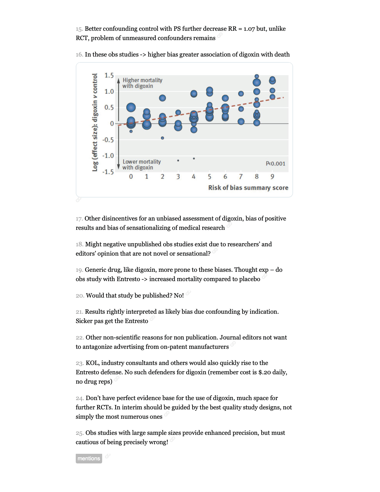

```{r setup, include=FALSE}
knitr::opts_chunk$set(echo = TRUE)
```
This is from a tweetorial looking at the safety and efficacy of digitalis in heart failure.    
{#id .class width=100% height=10% align=center}   
{#id .class width=100% height=10% align=center}

