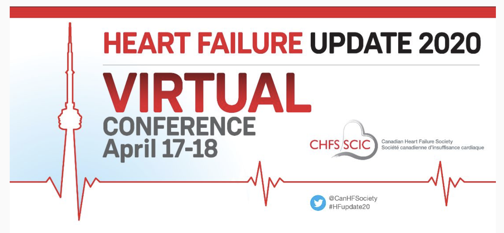
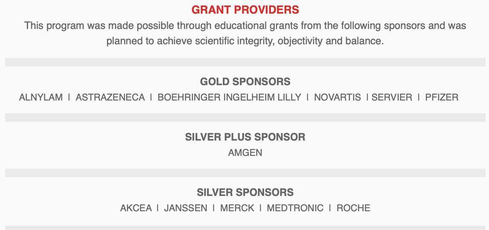

```{r setup, include=FALSE}
knitr::opts_chunk$set(echo = TRUE)
```
One positive from the **Covid-19** pandemic, is we have had to learn more techniques about online or virtual learning. The proliferation of these tools, such as Zoom, and our increased familiarity with their use will perhaps have a lasting impact on our learning processes. For example, with increased ease of online learning, perhaps we will reduce our carbon footprint for small, medium and even large medical conferences as we reduce our traveling and need for physical presence at these venues.     

Certainly in the academic world, we had to rapidly adapt (within a 2 week period) from giving standard onsite lectures to the virtual teaching world. Surprisingly, the transition was relatively painless. For example,  I gave the last 12 hours of the winter semester of my intermediate epidemiology course to 71 MSc students via Zoom. The cost of this is farily trivial. I believe the price of a premium Zoom subscription is about $20 / month.    
      
          
          
Given these facts I was not surprised to receive a recent email about an upcoming virtual course on heart failure.      
      
      
      
{width="75%" fig-align="center"}

However, what did surprise me was seeing that this symposium had **12 corporate sponsors**!     
     
          
          
{width="75%" fig-align="center"}   


This raises several questions:        
- Why are academics so tied in with coroporate interests?      
- Are academics only willing to participate if personal financial rewards are present?     
- Coroporations are not philatrophic organizations, so what is the payoff for them?     
- Is it a quasi guarantee that their products will be highlighted in a positive manner?     


