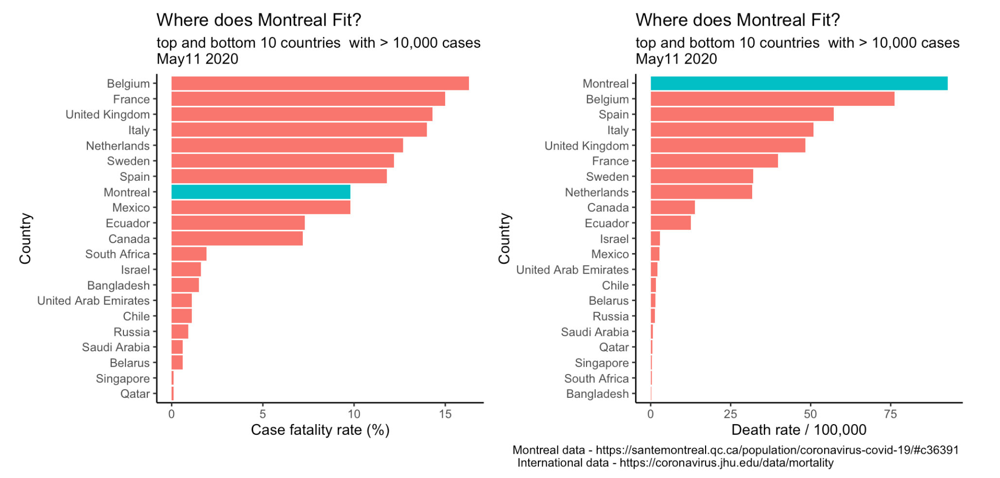

```{r setup, include=FALSE}
knitr::opts_chunk$set(echo = TRUE)
```

I was curious to see where Montreal placed in the global Covid-19 perspective.   
    

Looking at these figures, Montreal data looks very concerning but some caveats must be acknowledged.  

More testing would most likely help. If we were doing more testing and detecting less serious cases, our case fatality rate would not look so alarming. More importantly, more testing may lead to earlier identification of asymptomatic cases decreasing potential exposure to our more vulnerable populations thereby hopefully improving our overall death rates.     

However, it is unlikely that > 10-15 fold differences observed can be explained by differences in testing, respecting public health measures, Covid virulence, genetics, or health care delivery. Information bias from  variable and questionable data collection probably explains a lot of the variations. With questionable data, prediction models are associated with so much uncertainty their public health utility will be  limited.    

In addition to increased testing, we therefore need to enhance the reliability of data collection. This will be essential to better understanding our current and future positions and informing public policy.   

 
      
