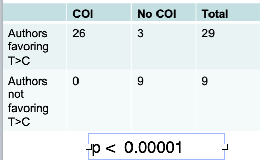

```{r setup, include=FALSE, fig.width= 12}
knitr::opts_chunk$set(echo = TRUE)

```

[\$678 million fine](https://www.nbcnews.com/business/economy/it-was-his-dream-job-he-never-thought-he-d-n1232971) testifies to how well these pharma bribes work, including the so-called CME events.
Any bets that this is continuing today?
Maybe more sophisticated and better camouflaged but still very present.

::: callout-note
## IMHO

**Biggest bang for pharma’s buck is to target guideline writers.**
:::

Here is an empirical example that may, or may not, be related to this story.
In 2012 Canadian, European and US guideline writers offered guidelines on dual antiplatelet therapy (DAPT) for acute coronary syndromes.
The comparison is straightforward as there was only 1 published RCT (PLATO), examining the standard clopidogrel therapy and the newer ticagrelor as so all guideline writers were working from the same evidence base.
CDN and European guideline writers "recommended ticagrelor over clopidogrel" while the US writers (0 of 9 writers had a conflict of interest), looking at the same data concluded "does not endorse one over the other".
Look at the 2X2table below between conflicts of interest among the different guideline writers and the ticagrelor manufacturer.

Play of chance or ...?


