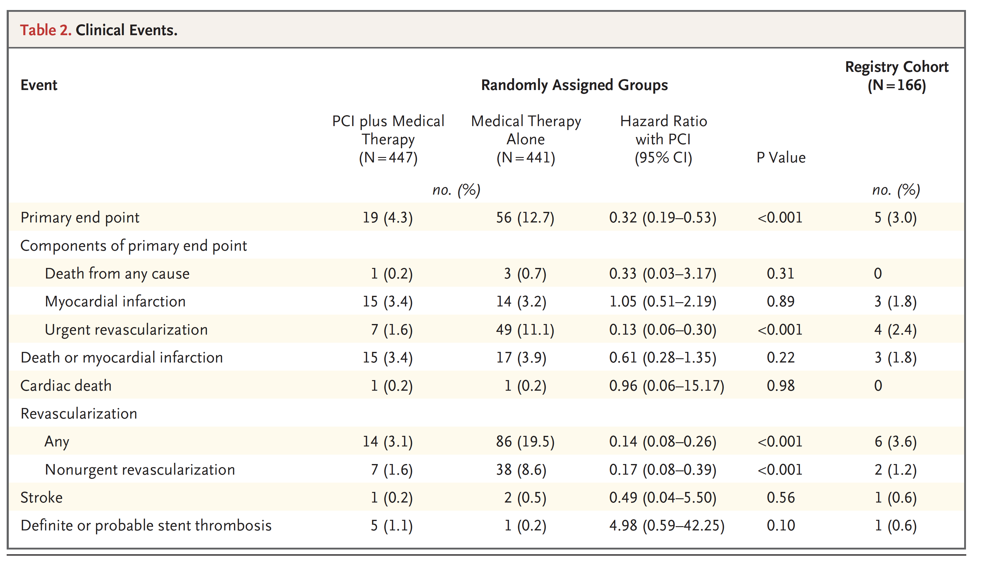

```{r setup, echo=FALSE, message = FALSE, warning = FALSE}
knitr::opts_chunk$set(
  echo = TRUE,
  fig.align = "center")

library(magrittr)
library(dplyr)
library(tidyr)
library(metafor)
library(ggdist)
library(tidybayes)
library(ggplot2)
library(cowplot)
library(rstan)
library(rstanarm)
library(cmdstanr)
library(brms)
library(RColorBrewer)
library(here)
library(knitr)
library(grid)
library(tidyverse)
library(broom)
library(ggdag)
library(baymedr) # devtools::install_github("maxlinde/baymedr")
library(gt) 
options(knitr.table.format = "html")
options(knitr.kable.NA = '   ')
rstan_options(auto_write = TRUE)
options(mc.cores = parallel::detectCores())
options(scipen = 1, digits = 2) #set to two decimal 

```

## Background

I was reminded this week of an old trial from 2012, [FAME-2](https://www.nejm.org/doi/full/10.1056/NEJMoa1205361) that concluded       

[> "In the FAME 2 trial, we compared the treatment strategy of percutaneous coronary interventions (PCI), performed according to current quality standards, plus the best available medical therapy with the best available medical therapy alone in patients with stable coronary artery disease and hemodynamically significant stenoses. FFR-guided PCI with drug-eluting stents plus the best available medical therapy, as compared with the best available medical therapy alone, resulted in significantly improved clinical outcomes."]{style="color: red;"}       

I was also reminded how annoyed I was at this very misleading conclusion. Not that it matters much but I wish I had bothered to blog about the study at the moment of its publication. OTOH, waiting has demonstrated the enormous impact an article in a high impact journal can have, even when the conclusions are quite erronous as this study has now been cited > 3600 times. The study has also been very influential in pushing [guidelines](https://www.ahajournals.org/doi/10.1161/CIR.0000000000001168#sec-3) to endorse PCI revascularizations as a preferred treatment option for stable chronic coronary disease 

## Summary study design and results

In the FAME 2 trial, the treatment strategy of PCI, performed according to current quality standards (FFR-guided PCI with drug-eluting stents), plus the best available medical therapy was compared with the best available medical therapy alone in patients with stable coronary artery disease and hemodynamically significant stenoses.    
A total of 888 patients had at least one hemodynamically significant stenosis with an FFR of 0.80 or less in a large epicardial artery: 447 patients were randomly assigned to FFR-guided PCI plus the best available medical therapy, and 441 patients to the best available medical therapy alone. During an average 7 month followup, the primary end point, a composite of death from any cause, nonfatal myocardial infarction, or 
urgent revascularizations were compared between the intervention and control arms.     
The results are as {width=100%}     

## What's my beef?

The core issue is whether PCI can simultaneously serve as an intervention in the intervention arm and as an outcome in the control arm. Now the authors would probably argue that the PCIs in the control arm are **"urgent"** and therefore different. However, it is exactly the same technique and "urgent" is merely a subjective adjective that is of questionable value in an unblinded study. Any complications from the revascularization whether urgent or not is captured by the other components of the composite primary outcome.     
So forgetting this ersatz distinction between "urgent" and routine PCI, the above Table 2 which treats all PCIs equally is modified as follows     
{width=100%}   

The code to produce these numbers is as follows;

```{r}
mat <- matrix(c(447,.5,93,348), byrow = TRUE, nrow=2,
              dimnames = list(c("PCI", "medical"),
                              c("outcome+", "outcome-")))

epiR::epi.2by2(mat, method="cohort.count")

mat1 <- matrix(c(447,.5,86,355), byrow = TRUE, nrow=2,
              dimnames = list(c("PCI", "medical"),
                              c("outcome+", "outcome-")))

epiR::epi.2by2(mat1, method="cohort.count")
```

 


## Conclusion

So if one treats *a revascularization as a revascularization as a revascularization* regardless of group assignment, one reaches the conclusion that the PCI intervention arm is associated with 5 times more interventions with no reduction in mortality or myocardial infarction. This is in stark contrast with how this trial has been interpreted. It is very alarming that the use of one subjective adjective can lead to such diametrically opposed conclusions.        
My final **take home mesaage** is    
[**If you can spin FAME-2 results, then you can probably successfully spin any results.**]{style="color: red;"}
