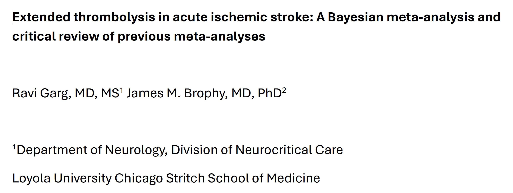
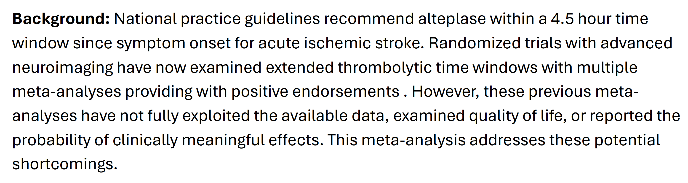
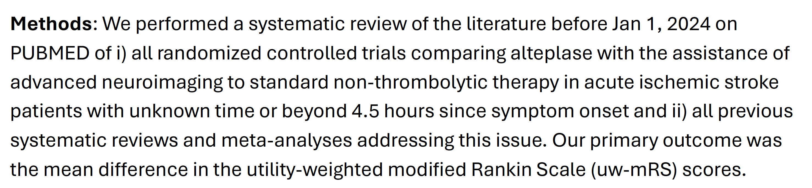
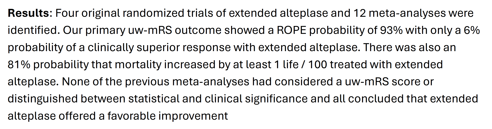
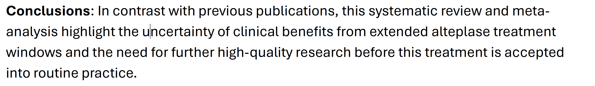
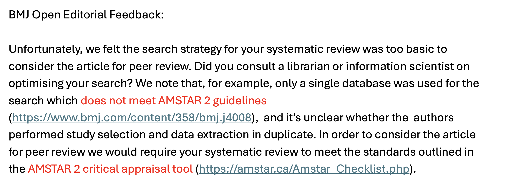
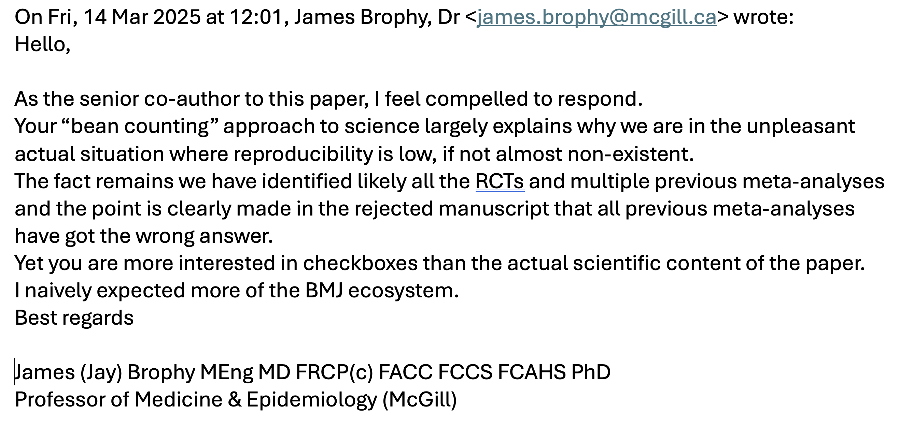
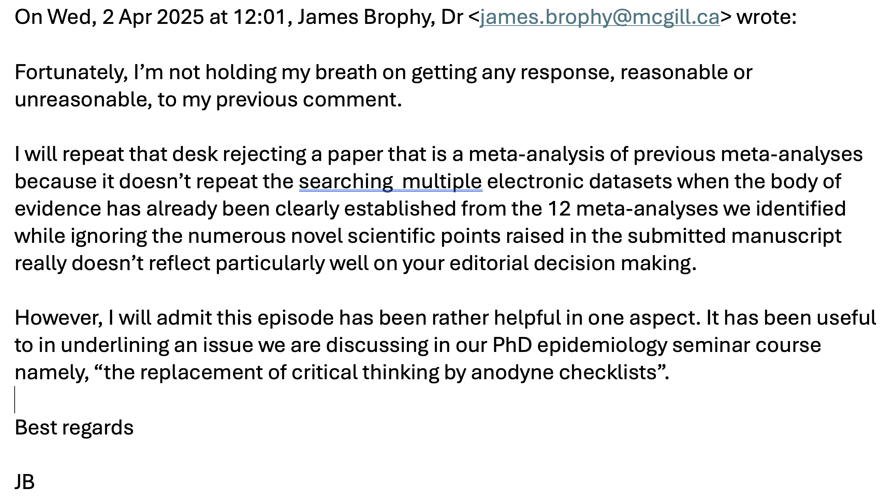

## Checklists

Checklists are appropriate for certain routine activities, but their usefulness diminishes for practices that require a deep understandings of complex situations involving  ambiguities and uncertainties. Why am I thinking of checklists?\   
Recently in collaboration with a colleague, we examined the effect of extended thrombolysis for stroke patients with a late hospital presentation. We submitted our manuscript to BMJ Open.

 

## The abstract

 

# Checklists, emails and how not to get published {.center}

## Checklists

I am obviously biased but I do think there are several scientific interesting findings in our study, not the least being that there have been 12 previous meta-analyses on this subject, although there have only been four original randomized trials. All 12 meta-analyses have reached the same conclusion, namely that extended thrombolysis is an effective therapy.\   
So a natural question, why do another meta-analysis? In fact, there are numerous reasons.\      
1. All previous RCTs and meta-analyses have not fully exploited the data. Stroke outcome has been collected on an ordinal scale, the modified Rankin scale, ranking from the degree of disability or dependency from 0 for no symptom to 6 for death. However all studies have dichtomized the data considering scores 0-1 to be a positive outcome and scores > 1 being a negative outcome. The dichotomization results in a loss of information.\   
2. Existing publications have not considered weighting these scores by validated quality of life scores.\    
3. Previous studies have not distinguished between statistical and clinical significance\  
4. The probability of increased moratlity ahs not been examined in isolation.\   

## Checklists and emails

Our paper was "desk rejected" with the following email\    

There is nothing unusual about getting a desk rejection, it comes with the territory, but the reasoning was incredibly lame a shown here.\   

No consideration about the novelty or scientific merit of the manuscript, just an easy quick desk rejection because we didn't follow a guideline of consulting multiple electronic database. No consideration that 12 previous meta-analyses had already done their due diligence checking multiple data sources and all had found only the same four RCTs that we analyzed. If the paper had been sent for peer review and the editor added as a minor comment the need to confirm to their standards by checking several electronic data sources, we would have gladly complied. But to be subject to a desk rejection for this trivial omission in this situation seems to border on the ludicrous.\      

## Checklists, more emails and how not to get published 

After a couple of days reflecting, I decided to share my thoughts with BMJ Open and sent them the following email.\    

I received a very nice acknowledgement informing me that my email would be forwarded to the Editor.

## Checklists, more emails and how not to get published 
Of course, I didn't expect to hear from the editor and haven't been disappointed. After relaying this story in a seminar course that was discussing checklists and critical thinking, a student challenged me to follow-up with an additional email which follows\    

I still have no reply to this email and the paper has been submitted to another journal. I do remain a bit saddened to realize that even editors of highly reputable journals seem all too ready to abandon critical thinking for the facility of anodyne checklists.
