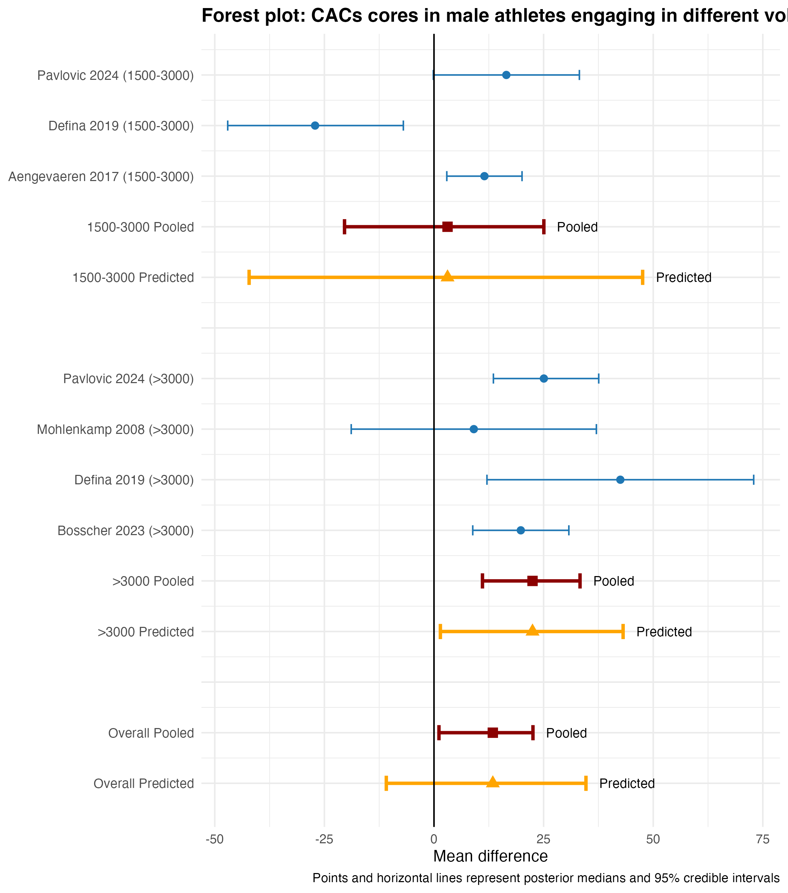

## Recent article - Background
A recent meta-analysis[@RN2] concluded “Males with high-volume exercise training (>3,000 MET-min/wk) exhibited a higher burden of calcified plaque by CAC score than male nonathletes, while no such difference was observed in female athletes.” Apart from the surprising observation of a positive association of increased exercise and increased cardiovascular risk factors, one is left wondering what was the original objective of this study. Perhaps a look at the pre-registered protocol (https://www.crd.york.ac.uk/PROSPERO/view/CRD42024573617) can help. Here the main outcome is stated

> The primary outcome of interest was analysis of coronary artery calcium (CAC) score (between athletes and non-athletes). 

There is no mention of preplanned analyses according to sex of either the primary or any secondary outcome. Of course, results from post hoc analyses carry less inferential validity.      

Even ignoring the apparent post hoc nature of the analysis, how should these results be interpreted? How can they be sensibly interpreted without an idea of the prior probability that women would behave differently than men or that heavy exercising men would behave worse than moderately exercising men?    
Even ignoring the lack of prior probabilities, does the data show as contended by the authors that  male athletes engaging in high-volume exercise compared to nonathletes have higher CAC scores than athletes with moderate volume exercise compared to nonathletes. The CAC values for male athletes compared to nonathletes was 1.2 (95% CI -24.66 to 27.05, p = 0.9) for < 3000 group and 31.62 (95% 10.66 to 52.58, p = 0.003) for group > 3000. Are these differences statistically significant? 


The fallacy of simply comparing significance levels has been well described  in several publications [@RN7649; @RN5623]. Testing for the statistical significance of the difference between two independent estimates is required to determine if they are statistically different and is easily implemented by calculating the risk difference and its confidence interval and p-value, as shown in the following code.

```{r}
###############
# Interaction test for risk ratio RR
###############

inter_test <- function(rr1, rr1LL, rr1UL, rr2, rr2LL, rr2UL, sig=0.975) {
  logSE1 <- abs(log(rr1UL) - log(rr1LL))/(2 * qnorm(sig)) #se of log(rr1), default 95%CI, sig = 1 sided value
  logSE2 <- abs(log(rr2UL) - log(rr2LL))/(2 * qnorm(sig)) #se of log(rr1)
  diffLogRR <- log(rr1) - log(rr2) #diff of log rr
  logRR_SE <- sqrt(logSE1^2 + logSE2^2) #log (se) of differences
  logRR_UCI <- diffLogRR + qnorm(sig) * logRR_SE
  logRR_LCI <- diffLogRR - qnorm(sig) * logRR_SE
  RR <- exp(diffLogRR) # RR point estimate
  RR_UCI <- exp(logRR_UCI) # RR upper CI
  RR_LCI <- exp(logRR_LCI) # RR lower CI
  RR_SE <- (RR_UCI - RR_LCI) / (2*1.96)
  z <- diffLogRR / logRR_SE
  pvalue <- 2*(1-pnorm(abs(z))) #p value for the interaction term
  state1 <- cat("The relative risk for the interaction is ", RR, ", 95% CI ", RR_LCI, " - ", RR_UCI, " and p value =" , pvalue)
}

###############
# Interaction test for risk difference #
###############

inter_test_rd <- function(rd1, rd1LL, rd1UL, rd2, rd2LL, rd2UL, sig=0.975) {
  se1 <- abs(rd1UL - rd1LL)/(2 * qnorm(sig)) #se of risk difference 1
  se2 <- abs(rd2UL - rd2LL)/(2 * qnorm(sig)) #se of risk difference 2
  diffRD <- rd1 - rd2 #diff of risk difference
  RD_SE <- sqrt(se1^2 + se2^2) #se of differences
  RD_UCI <- diffRD + qnorm(sig) * RD_SE
  RD_LCI <- diffRD - qnorm(sig) * RD_SE
  pvalue <- 2*(1-pnorm(abs(diffRD/RD_SE))) #p value for the interaction term
  # cat("The risk difference for the interaction is ", diffRD, ", 95% CI ", RD_LCI, " - ", RD_UCI, " and p value =" , pvalue)
  list(diffRD = diffRD, RD_LCI = RD_LCI, RD_UCI = RD_UCI, pvalue = pvalue)
}


rd_out <- inter_test_rd(1.2, -24.66, 27.05, 31.62, 10.66, 52.58)
```


The risk difference for the interaction is  `r rd_out$diffRD`, (95% CI  `r round(rd_out$RD_LCI,2)` to `r round(rd_out$RD_UCI,2)`,  p = `r round(rd_out$pvalue,2)`). The key insight being “In making a comparison between two group, one should look at the statistical significance of the difference rather than the difference between their significance levels”[@RN7649]. Thus, there is no statistical evidence of a difference in CAC values between male athletes engaging in high-volume exercise compared to nonathletes and male athletes with moderate volume exercise compared to nonathletes. This becomes more evident if the forest plots (Bayesian with vague priors) are recreated with the prediction intervals showing the considerable overalp in the predcited next study for the subgroups.
```{r eval=FALSE}
# men
# ---- Packages ----
library(tidyverse)
library(brms)
library(tidybayes)
library(cmdstanr)

options(mc.cores = parallel::detectCores())

# ---- Data (extracted from your figure) ----
df <- tribble(
  ~group,        ~study,               ~yi,   ~lower,   ~upper,
  "1500-3000",   "Aengevaeren 2017",   11.50,   2.92,   20.08,
  "1500-3000",   "Pavlovic 2024",      16.50,  -0.16,   33.16,
  "1500-3000",   "Defina 2019",       -27.12, -47.05,   -6.99,
  ">3000",       "Bosscher 2023",      19.80,   8.84,   30.76,
  ">3000",       "Mohlenkamp 2008",     9.08, -18.88,   37.04,
  ">3000",       "Pavlovic 2024",      25.06,  13.55,   37.57,
  ">3000",       "Defina 2019",        42.50,  12.08,   72.92
) %>%
  mutate(
    sei = (upper - lower) / (2 * 1.96),
    study = factor(study),
    group = factor(group, levels = c("1500-3000", ">3000")) # explicit subgroup order
  )

# ---- Priors: vague but weakly informative ----
priors <- c(
  prior(normal(0, 50), class = "Intercept"),              # mu ~ N(0, 50^2)
  prior(student_t(3, 0, 10), class = "sd", group = "study")# tau ~ t(3,0,10)
)

# ---- Fit models ----
fit_all <- brm(yi | se(sei) ~ 1 + (1 | study),
               data = df, family = gaussian(),
               prior = priors, backend = "cmdstanr",
               iter = 4000, chains = 4, seed = 123)

# Save the model object to disk
saveRDS(fit_all, file = "model/fit_all.rds")


fit_1500 <- brm(yi | se(sei) ~ 1 + (1 | study),
                data = dplyr::filter(df, group == "1500-3000"),
                family = gaussian(), prior = priors,
                backend = "cmdstanr", iter = 4000, chains = 4, seed = 123)
saveRDS(fit_all, file = "model/fit_1500.rds")

fit_3000 <- brm(yi | se(sei) ~ 1 + (1 | study),
                data = dplyr::filter(df, group == ">3000"),
                family = gaussian(), prior = priors,
                backend = "cmdstanr", iter = 4000, chains = 4, seed = 123)
saveRDS(fit_all, file = "model/fit_3000.rds")

# ---- Posterior draws ----
draws_all <- fit_all %>% spread_draws(b_Intercept, sd_study__Intercept)
draws_1   <- fit_1500 %>% spread_draws(b_Intercept, sd_study__Intercept)
draws_2   <- fit_3000 %>% spread_draws(b_Intercept, sd_study__Intercept)

# ---- Summaries (μ and τ) ----
summarise_mu_tau <- function(dr) {
  tibble(
    mu_median  = median(dr$b_Intercept),
    mu_low     = quantile(dr$b_Intercept, 0.025),
    mu_high    = quantile(dr$b_Intercept, 0.975),
    tau_median = median(dr$sd_study__Intercept),
    tau_low    = quantile(dr$sd_study__Intercept, 0.025),
    tau_high   = quantile(dr$sd_study__Intercept, 0.975)
  )
}
summ_all <- summarise_mu_tau(draws_all)
summ_1   <- summarise_mu_tau(draws_1)
summ_2   <- summarise_mu_tau(draws_2)

# ---- Prediction intervals (new TRUE study effect) ----
summarise_pred <- function(dr) {
  theta_new <- dr$b_Intercept + rnorm(nrow(dr)) * dr$sd_study__Intercept
  tibble(
    pred_low  = quantile(theta_new, 0.025),
    pred_high = quantile(theta_new, 0.975)
  )
}
pi_all <- summarise_pred(draws_all)
pi_1   <- summarise_pred(draws_1)
pi_2   <- summarise_pred(draws_2)

# ---- Build plotting rows with exact order ----
# Desired order from TOP to BOTTOM:
# 1) Subgroup "1500-3000": its studies (top), then "1500-3000 Pooled", then "1500-3000 Predicted"
#    then a GAP
# 2) Subgroup ">3000":     its studies, then ">3000 Pooled", then ">3000 Predicted"
#    then a GAP
# 3) Overall:              "Overall Pooled", then "Overall Predicted" (very bottom)

# Helper to make study rows
make_study_rows <- function(dsub, label_group) {
  dsub %>%
    mutate(
      lab   = paste0(study, " (", label_group, ")"),
      type  = "study",
      xmin  = lower, x = yi, xmax = upper,
      col   = "#1f77b4", shape = NA_real_
    ) %>%
    select(lab, type, xmin, x, xmax, col, shape)
}

# Helper to make pooled + predicted rows (in that order)
make_summary_rows <- function(summ, pi, label_group) {
  pooled <- tibble(
    lab   = paste0(label_group, " Pooled"),
    type  = "pooled",
    xmin  = summ$mu_low, x = summ$mu_median, xmax = summ$mu_high,
    col   = "darkred", shape = 15
  )
  predicted <- tibble(
    lab   = paste0(label_group, " Predicted"),
    type  = "predicted",
    xmin  = pi$pred_low, x = summ$mu_median, xmax = pi$pred_high,
    col   = "orange", shape = 17
  )
  dplyr::bind_rows(pooled, predicted)
}

rows_top_to_bottom <- dplyr::bind_rows(
  # Subgroup 1500–3000 block
  make_study_rows(df %>% dplyr::filter(group == "1500-3000") %>% dplyr::arrange(dplyr::desc(study)), "1500-3000"),
  make_summary_rows(summ_1, pi_1, "1500-3000"),
  tibble(lab = "", type = "gap", xmin = NA, x = NA, xmax = NA, col = NA, shape = NA_real_),

  # Subgroup >3000 block
  make_study_rows(df %>% dplyr::filter(group == ">3000") %>% dplyr::arrange(dplyr::desc(study)), ">3000"),
  make_summary_rows(summ_2, pi_2, ">3000"),
  tibble(lab = "", type = "gap", xmin = NA, x = NA, xmax = NA, col = NA, shape = NA_real_),

  # Overall at very bottom: pooled then predicted
  make_summary_rows(summ_all, pi_all, "Overall")
)

rows_top_to_bottom <- rows_top_to_bottom %>%
  mutate(row_id = dplyr::row_number()) %>%
  mutate(y = rev(row_id))

library(ggplot2)

p <- ggplot(rows_top_to_bottom, aes(y = y, x = x)) +
  geom_errorbarh(data = dplyr::filter(rows_top_to_bottom, type == "study"),
                 aes(xmin = xmin, xmax = xmax), height = 0.2,
                 color = "#1f77b4") +
  geom_point(data = dplyr::filter(rows_top_to_bottom, type == "study"),
             color = "#1f77b4", size = 2) +
  geom_errorbarh(data = dplyr::filter(rows_top_to_bottom, type == "pooled"),
                 aes(xmin = xmin, xmax = xmax), height = 0.3,
                 color = "darkred", size = 1.1) +
  geom_point(data = dplyr::filter(rows_top_to_bottom, type == "pooled"),
             aes(shape = factor(shape)), color = "darkred", size = 3) +
  geom_errorbarh(data = dplyr::filter(rows_top_to_bottom, type == "predicted"),
                 aes(xmin = xmin, xmax = xmax), height = 0.3,
                 color = "orange", size = 1.1) +
  geom_point(data = dplyr::filter(rows_top_to_bottom, type == "predicted"),
             aes(shape = factor(shape)), color = "orange", size = 3) +
  geom_vline(xintercept = 0, color = "black") +
  geom_text(data = dplyr::filter(rows_top_to_bottom, type == "pooled"),
            aes(x = xmax + 3, y = y, label = "Pooled"),
            hjust = 0, size = 3.2) +
  geom_text(data = dplyr::filter(rows_top_to_bottom, type == "predicted"),
            aes(x = xmax + 3, y = y, label = "Predicted"),
            hjust = 0, size = 3.2) +
  scale_y_continuous(
    breaks = rows_top_to_bottom$y,
    labels = rows_top_to_bottom$lab
  ) +
  scale_shape_manual(values = c(`15` = 15, `17` = 17), guide = "none") +
  labs(
    x = "Mean difference", y = NULL,
    title = "Forest plot: CACs cores in male athletes engaging in different volumes of exercise",
    caption = "Points and horizontal lines represent posterior medians and 95% credible intervals") +
  theme_minimal() +
  theme(
    axis.text.y = element_text(size = 9),
    plot.title = element_text(size = 13, face = "bold")
  )

# Save plot
ggsave("images/male_forest_plot.png", p, width = 7.5, height = 8.5, dpi = 300)
ggsave("images/male_forest_plot.pdf", p, width = 7.5, height = 8.5)

```



What if the authors had followed their protocol and examined CAC scores in all athletes compared to nonathletes? 
```{r eval=FALSE}
# ---- Packages ----
library(tidyverse)
library(brms)
library(tidybayes)
library(cmdstanr)

options(mc.cores = parallel::detectCores())

# ---- Data (extracted from your figure) ----

# ---- Data (COMBINED Male + Female) ----

# ---- Data (COMBINED Male + Female, grouped) ----

df <- tribble(
  ~group,        ~study,               ~yi,    ~lower,    ~upper,
  "1500-3000",   "Aengevaeren 2017",   -1.75,  -13.54,    10.04,
  "1500-3000",   "Pavlovic 2024",      13.25,   -2.58,    29.08,
  "1500-3000",   "Defina 2019",       -23.56,  -43.53,    -3.50,
  ">3000",       "Bosscher 2023",      17.40,    4.42,    30.38,
  ">3000",       "Mohlenkamp 2008",     7.04,  -14.44,    28.52
) %>%
  mutate(
    sei = (upper - lower) / (2 * 1.96),
    study = factor(study),
    group = factor(group, levels = c("1500-3000", ">3000"))
  )

    

# ---- Priors: vague but weakly informative ----
priors <- c(
  prior(normal(0, 50), class = "Intercept"),              # mu ~ N(0, 50^2)
  prior(student_t(3, 0, 10), class = "sd", group = "study")# tau ~ t(3,0,10)
)

# ---- Fit models ----
fit_all <- brm(yi | se(sei) ~ 1 + (1 | study),
               data = df, family = gaussian(),
               prior = priors, backend = "cmdstanr", 
               iter = 4000, chains = 4, seed = 123, refresh = 0)

# Save the model object to disk
saveRDS(fit_all, file = "model/combined_all.rds")


fit_1500 <- brm(yi | se(sei) ~ 1 + (1 | study),
                data = dplyr::filter(df, group == "1500-3000"),
                family = gaussian(), prior = priors,
                backend = "cmdstanr", iter = 4000, chains = 4, seed = 123, refresh = 0)
saveRDS(fit_all, file = "model/combined_1500.rds")

fit_3000 <- brm(yi | se(sei) ~ 1 + (1 | study),
                data = dplyr::filter(df, group == ">3000"),
                family = gaussian(), prior = priors,
                backend = "cmdstanr", iter = 4000, chains = 4, refresh = 0, seed = 123)
saveRDS(fit_all, file = "model/combined_3000.rds")

fit_all <- readRDS("model/combined_all.rds")
fit_1500 <- readRDS("model/combined_1500.rds")
fit_3000 <- readRDS("model/combined_3000.rds")

# ---- Posterior draws ----
draws_all <- fit_all %>% spread_draws(b_Intercept, sd_study__Intercept)
draws_1   <- fit_1500 %>% spread_draws(b_Intercept, sd_study__Intercept)
draws_2   <- fit_3000 %>% spread_draws(b_Intercept, sd_study__Intercept)

# ---- Summaries (μ and τ) ----
summarise_mu_tau <- function(dr) {
  tibble(
    mu_median  = median(dr$b_Intercept),
    mu_low     = quantile(dr$b_Intercept, 0.025),
    mu_high    = quantile(dr$b_Intercept, 0.975),
    tau_median = median(dr$sd_study__Intercept),
    tau_low    = quantile(dr$sd_study__Intercept, 0.025),
    tau_high   = quantile(dr$sd_study__Intercept, 0.975)
  )
}
summ_all <- summarise_mu_tau(draws_all)
summ_1   <- summarise_mu_tau(draws_1)
summ_2   <- summarise_mu_tau(draws_2)

# ---- Prediction intervals (new TRUE study effect) ----
summarise_pred <- function(dr) {
  theta_new <- dr$b_Intercept + rnorm(nrow(dr)) * dr$sd_study__Intercept
  tibble(
    pred_low  = quantile(theta_new, 0.025),
    pred_high = quantile(theta_new, 0.975)
  )
}
pi_all <- summarise_pred(draws_all)
pi_1   <- summarise_pred(draws_1)
pi_2   <- summarise_pred(draws_2)

# ---- Build plotting rows with exact order ----
# Desired order from TOP to BOTTOM:
# 1) Subgroup "1500-3000": its studies (top), then "1500-3000 Pooled", then "1500-3000 Predicted"
#    then a GAP
# 2) Subgroup ">3000":     its studies, then ">3000 Pooled", then ">3000 Predicted"
#    then a GAP
# 3) Overall:              "Overall Pooled", then "Overall Predicted" (very bottom)

# Helper to make study rows
make_study_rows <- function(dsub, label_group) {
  dsub %>%
    mutate(
      lab   = paste0(study, " (", label_group, ")"),
      type  = "study",
      xmin  = lower, x = yi, xmax = upper,
      col   = "#1f77b4", shape = NA_real_
    ) %>%
    select(lab, type, xmin, x, xmax, col, shape)
}

# Helper to make pooled + predicted rows (in that order)
make_summary_rows <- function(summ, pi, label_group) {
  pooled <- tibble(
    lab   = paste0(label_group, " Pooled"),
    type  = "pooled",
    xmin  = summ$mu_low, x = summ$mu_median, xmax = summ$mu_high,
    col   = "darkred", shape = 15
  )
  predicted <- tibble(
    lab   = paste0(label_group, " Predicted"),
    type  = "predicted",
    xmin  = pi$pred_low, x = summ$mu_median, xmax = pi$pred_high,
    col   = "orange", shape = 17
  )
  dplyr::bind_rows(pooled, predicted)
}

rows_top_to_bottom <- dplyr::bind_rows(
  # Subgroup 1500–3000 block
  make_study_rows(df %>% dplyr::filter(group == "1500-3000") %>% dplyr::arrange(dplyr::desc(study)), "1500-3000"),
  make_summary_rows(summ_1, pi_1, "1500-3000"),
  tibble(lab = "", type = "gap", xmin = NA, x = NA, xmax = NA, col = NA, shape = NA_real_),
  
  # Subgroup >3000 block
  make_study_rows(df %>% dplyr::filter(group == ">3000") %>% dplyr::arrange(dplyr::desc(study)), ">3000"),
  make_summary_rows(summ_2, pi_2, ">3000"),
  tibble(lab = "", type = "gap", xmin = NA, x = NA, xmax = NA, col = NA, shape = NA_real_),
  
  # Overall at very bottom: pooled then predicted
  make_summary_rows(summ_all, pi_all, "Overall")
)

rows_top_to_bottom <- rows_top_to_bottom %>%
  mutate(row_id = dplyr::row_number()) %>%
  mutate(y = rev(row_id))

library(ggplot2)

p <- ggplot(rows_top_to_bottom, aes(y = y, x = x)) +
  geom_errorbarh(data = dplyr::filter(rows_top_to_bottom, type == "study"),
                 aes(xmin = xmin, xmax = xmax), height = 0.2,
                 color = "#1f77b4") +
  geom_point(data = dplyr::filter(rows_top_to_bottom, type == "study"),
             color = "#1f77b4", size = 2) +
  geom_errorbarh(data = dplyr::filter(rows_top_to_bottom, type == "pooled"),
                 aes(xmin = xmin, xmax = xmax), height = 0.3,
                 color = "darkred", size = 1.1) +
  geom_point(data = dplyr::filter(rows_top_to_bottom, type == "pooled"),
             aes(shape = factor(shape)), color = "darkred", size = 3) +
  geom_errorbarh(data = dplyr::filter(rows_top_to_bottom, type == "predicted"),
                 aes(xmin = xmin, xmax = xmax), height = 0.3,
                 color = "orange", size = 1.1) +
  geom_point(data = dplyr::filter(rows_top_to_bottom, type == "predicted"),
             aes(shape = factor(shape)), color = "orange", size = 3) +
  geom_vline(xintercept = 0, color = "black") +
  geom_text(data = dplyr::filter(rows_top_to_bottom, type == "pooled"),
            aes(x = xmax + 3, y = y, label = "Pooled"),
            hjust = 0, size = 3.2) +
  geom_text(data = dplyr::filter(rows_top_to_bottom, type == "predicted"),
            aes(x = xmax + 3, y = y, label = "Predicted"),
            hjust = 0, size = 3.2) +
  scale_y_continuous(
    breaks = rows_top_to_bottom$y,
    labels = rows_top_to_bottom$lab
  ) +
  scale_shape_manual(values = c(`15` = 15, `17` = 17), guide = "none") +
  labs(
    x = "Mean difference", y = NULL,
    title = "Forest plot: CACs cores in male & female athletes engaging in different volumes of exercise",
    caption = "Points and horizontal lines represent posterior medians and 95% credible intervals") +
  theme_minimal() +
  theme(
    axis.text.y = element_text(size = 9),
    plot.title = element_text(size = 13, face = "bold")
  )

# Save plot
ggsave("images/combined_forest_plot.png", p, width = 7.5, height = 8.5, dpi = 300)
ggsave("images/combined_forest_plot.pdf", p, width = 7.5, height = 8.5)

```


The plot shows mean difference = 3.6 (95% CI -10.3 to 16.5), with no evidence of a statistically significant difference.

## Conclusion
The original objective of the meta-analysis was to compare CAC scores in athletes versus nonathletes and while not reported in the final publication, this showed no meaningful differences. The authors reported only post hoc analyses according to sex and claim that "males with high-volume exercise training (>3,000 MET-min/wk) exhibited a higher burden of calcified plaque by CAC score than male nonathletes". This is somewhat disengenous as there was no difference between lower level exercise training (1,500 - 3,000 MET-min/wk) and calcified plaque by CAC score compared to male nonathletes, nor was there any statistically significant difference when comparing the high amd low groups.       

It is well known that positive results have a higher probability of being published and a cynical reader might wonder if the authors, aware of this, were simply looking for anything positive, or at least trending to positive, to report and found it by examining subgroups according to sex and level of exercise training. This is known as p-hacking, although the proper analysis did not find a statistically significant p value, and is a well recognized source of bias in the scientific literature.     

Deviations from the preregistered protocol, ignoring prior evidence  of exercise benefits, and questionable statistical analyses weaken any  possible useful inferences from this study. What then is the legacy of the publication beyond adding to the authors' CVs?

## References
