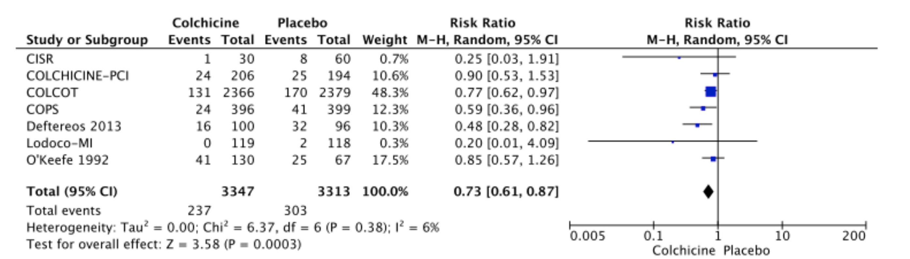
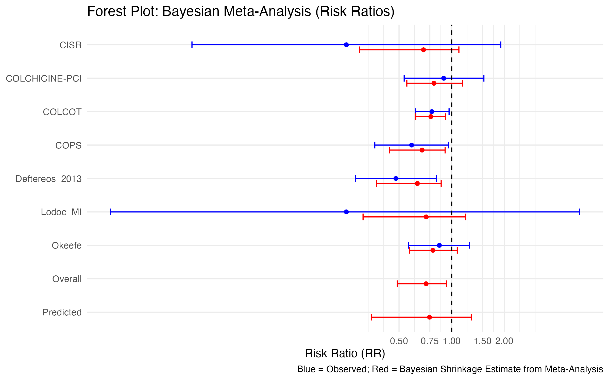
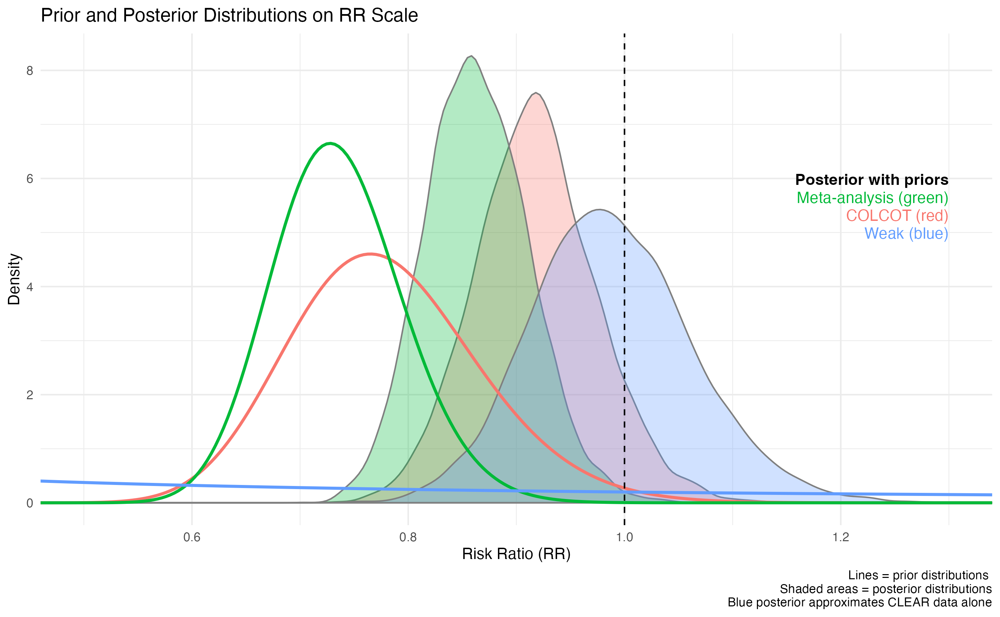

## A recent article

In February 2025, the CLEAR investigators[@RN7633] published the results of their large randomized controlled trial (RCT) of colchicine (n = 3528) versus placebo (n = 3534) in post myocardial infarction patients.
The rationale for the study was that colchicine, an anti-inflammatory drug, might reduce major adverse cardiovascular events (MACE) by reducing inflammation after myocardial infarction.
Previous smaller trials and meta-analyses had suggested a benefit, but the evidence was not definitive.

The primary outcome was MACE, a composite of cardiovascular death, myocardial infarction, stroke, or ischemia-driven revascularization.
With a median 3-year follow-up, there were 9.1% events in the colchicine group and 9.3% in the placebo arm (hazard ratio, 0.99; 95% CI, 0.85-1.16).
Because of the high-quality study design, execution, and large number of primary outcome events (n = 649), the authors reasoned that the probability of a spurious result was low.
Thus, they concluded   

<font color="red">
> “...treatment with colchicine, when started soon after myocardial infarction and continued for a median of 3 years, did not reduce the incidence of the composite primary outcome.”

</font>

CLEAR investigators[@RN7633] acknowledge a previous large COLCOT trial[@RN5451] (n = 4745), reported a significant reduction in MACE with colchicine (HR 0.77, 95% CI 0.61-0.96, p = 0.02) but make no attempt to reconcile the conflicting results or to provide a synthesis of the totality of evidence.     

## A recent meta-analysis

Only one month after the CLEAR publication a formal meta-analysis of all available colchicine trials for secondary prevention of vascular events was fast tracked for publication in the European Heart Journal[RN7658], one of the top three most influential general cardiology journals worldwide (impact factor 35.6). They concluded

<font color="red">
> “In patients with prior coronary disease or stroke, colchicine reduced the composite of cardiovascular death, myocardial infarction, or stroke by 12%.”

</font>

What is mot interesting about this meta-analysis, ignoring the lack of any measure of uncertainty surrounding their benefit estimate, is that that first and senior authors of this meta-analysis are CLEAR investigators who one month earlier reaches a directly contradictory conclusion. Given the absence of any additional evidence between these two publications, how can this be?    
I attribute this to a blind adhesion to **frequentist statistics** which   

<font color="red">
> apparently allows investigators to declare both that the treatment does not, and simultaneously does work, all with same available evidence!!!

</font>

## A path forward

Bayesian statistics provide several advantages over more traditional methods,specifically helping to decide when additional research is required, how to interpret the new results,
and how to synthesize and communicate the totality of the evidence are presented. Let's consider each of these possible advantages in the context of colchicine and cardiovascular disease prevention.

1. **Deciding when additional research is required.** Bayesian methods can formally and principally incorporate prior knowledge / beliefs and their associated uncertainty into the analysis, according to the laws of probability, providing meaningful advantages over frequentist analyses. Consider in 2022, before the CLEAR trial was conducted, a meta-analysis of the existing colchicine evidence was published[@RN7092] and concluded   

<font color="red">
> "Colchicine significantly reduced the risk of MACE in patients with CAD who underwent PCI, mostly in the reduction of repeat vessel revascularisation, stroke and stent thrombosis (risk ratio 0.73 (95% CI 0.61 to 0.87); p=0.0003).

</font>

```{r fig_meta_2022, echo=FALSE, fig.cap='Forest plot from 2022 meta-analysis [@RN7092]', out.width='600px', fig.align='center'}

```

Given the magnitude of the effect and its statistical significance, this frequentist analysis might have been interpreted as providing definitive evidence for colchicine's benefit and that further trials are unnecessary, ethically dubious and potentially a waste of time and resources. Had the CLEAR investigators relied on the pooled summary estimate from this meta-analysis, they would have prematurely abandoned their trial.  

However, this meta-analysis conclusion is based on frequentist statistics and ignores the uncertainty in the estimates of the individual trials and in their between study heterogeneity. Consequently despite the appearance of little heterogeneity, this has been under-estimated and lacks power, given the small number of studies. Moreover the published analysis provides only a point estimate and confidence interval for the average pooled effect, and the prediction interval for the true effect in a new trial might be much wider. Although the utility of prediction intervals has been stressed[@RN2435; @RN6702] they rarely are included in standard meta-analyses.

A Bayesian meta-analysis of this pre-CLEAR data would have avoided these issues and avoided the cognitive biases often associated with the frequentist null hypothesis significance testing paradigm[@RN5257.  

```{r eval=FALSE}
# setup
knitr::opts_chunk$set(echo = TRUE, message = FALSE, warning = FALSE)
suppressPackageStartupMessages({
  library(readr)
  library(cmdstanr)
  library(ggplot2)
  library(ggdist)
  library(dplyr)
  library(posterior)
  library(metafor)
})

# data 

df_raw <- tibble::tribble(
  ~study, ~evt_trt, ~N_trt, ~evt_ctl, ~N_ctl,
  "CISR", 1, 30, 8, 60,
  "COLCHICINE-PCI", 24, 206, 25, 194,
  "COLCOT", 131, 2366, 170, 2379,
  "COPS", 24, 396, 41, 399,
  "Deftereos_2013", 16, 100, 32, 96,
  "Lodoc_MI", 0.5, 120, 2, 118,
  "Okeefe", 41, 130, 25, 67
)

df <- df_raw %>%
  mutate(
    p_t = evt_trt / N_trt,
    p_c = evt_ctl / N_ctl,
    log_rr = log(p_t / p_c),
    se_rr = sqrt((1 - p_t) / (p_t * N_trt) + (1 - p_c) / (p_c * N_ctl))
  )

# Write Stan model
meta_code <- c(
  "data {",
  "  int<lower=0> J;",
  "  vector[J] y;",
  "  vector<lower=0>[J] sigma;",
  "}",
  "parameters {",
  "  real mu;",
  "  real<lower=0> tau;",
  "  vector[J] theta;",
  "}",
  "model {",
  "  mu ~ normal(0, 1);",
  "  tau ~ normal(0, 1);",       # Half-normal due to lower=0 , another choice truncated cauchy(0, 1) T[0, 2];
  "  theta ~ normal(mu, tau);",
  "  y ~ normal(theta, sigma);",
  "}"
)
writeLines(meta_code, 'model/meta_model.stan')

log_rr <- df$log_rr
se <- df$se_rr
study_labels <- df$study
data_list <- list(J = length(log_rr), y = log_rr, sigma =  se)

mod <- cmdstan_model('model/meta_model.stan')
fit <- mod$sample(data = data_list, chains = 4, iter_warmup = 1000, iter_sampling =            2000, seed = 1234, refresh = 0)

draws <- as_draws_df(fit$draws(c("mu", "tau")))

# Draws for each theta and mu
theta_draws <- as_draws_df(fit$draws(c("mu", "theta")))

# 95% CI for observed RR
obs_lower <- exp(log_rr - 1.96 * se)
obs_upper <- exp(log_rr + 1.96 * se)

# Posterior mean and 95% CI for each study
post_rr_mean <- sapply(1:7, function(i) mean(exp(theta_draws[[paste0("theta[", i, "]")]])))
post_rr_lower <- sapply(1:7, function(i) quantile(exp(theta_draws[[paste0("theta[", i, "]")]]), 0.025))
post_rr_upper <- sapply(1:7, function(i) quantile(exp(theta_draws[[paste0("theta[", i, "]")]]), 0.975))

# Overall posterior mean and CI
overall_rr <- exp(theta_draws$mu)
overall_rr_mean <- mean(overall_rr)
overall_rr_ci <- quantile(overall_rr, probs = c(0.025, 0.975))

# Predictive RR
mu_vals <- theta_draws$mu
tau_vals <- as_draws_df(fit$draws("tau"))$tau
set.seed(123)
pred_draws <- rnorm(4000, mu_vals, tau_vals)
pred_rr <- exp(pred_draws)
pred_rr_mean <- mean(pred_rr)
pred_rr_ci <- quantile(pred_rr, probs = c(0.025, 0.975))


# Forest plot
plot_data <- data.frame(
  Study = factor(c(study_labels, "Overall", "Predicted"), levels = rev(c(study_labels, "Overall", "Predicted"))),
  Observed_RR = c(round(exp(log_rr), 2), NA, NA),
  Observed_Lower = c(obs_lower, NA, NA),
  Observed_Upper = c(obs_upper, NA, NA),
  Borrowed_RR = c(post_rr_mean, overall_rr_mean, pred_rr_mean),
  Borrowed_Lower = c(post_rr_lower, overall_rr_ci[1], pred_rr_ci[1]),
  Borrowed_Upper = c(post_rr_upper, overall_rr_ci[2], pred_rr_ci[2])
)

offset <- 0.15  # adjust for spacing

gg <- ggplot(plot_data) +
  # Observed (blue)
  geom_point(aes(x = Observed_RR, y = Study), color = "blue") +
  geom_errorbar(aes(xmin = Observed_Lower, xmax = Observed_Upper, y = Study),
                 height = 0.2, color = "blue") +
  
  # Borrowed (red) shifted down
  geom_point(aes(x = Borrowed_RR, y = Study), color = "red",
             position = position_nudge(y = -offset)) +
  geom_errorbarh(aes(xmin = Borrowed_Lower, xmax = Borrowed_Upper, y = Study),
                 height = 0.2, color = "red",
                 position = position_nudge(y = -offset)) +
  
  geom_vline(xintercept = 1, linetype = "dashed") +
  scale_x_continuous(trans = "log", breaks = c(0.5, 0.75, 1, 1.5, 2)) +
  labs(
    title = "Forest Plot: Bayesian Meta-Analysis (Risk Ratios)",
    x = "Risk Ratio (RR)", y = NULL,
    caption = "Blue = Observed; Red = Bayesian Shrinkage Estimate from Meta-Analysis"
  ) +
  theme_minimal()

print(gg)
ggsave("output/forest_bayes_preCLEAR.png", plot = gg, width = 8, height = 5, dpi = 300)
```


```{r fig_meta_2022_bayes, echo=FALSE, fig.cap='Bayesian forest plot based on 2022  meta-analysis', out.width='600px', fig.align='center'}

```

This analysis does allow a more nuanced assessment of the need for further research as while the overall (pooled average) 95% credible interval is < 1, the clinical significance is not assured and the wide prediction interval for the next study justifies the need for a future (CLEAR) trial. An advantage of the Bayesian approach is that it improves the estimates for each individual study by the borrowing of strength from the other studies, shrinking extreme estimates towards the overall mean. This is particularly useful for small studies with large uncertainty, as seen in the forest plot above.      

2. **Interpreting new results.** After the CLEAR trial[@RN7633] was published, a frequentist meta-analysis[@RN7658] including CLEAR concluded that colchicine reduced MACE by 12%. This conclusion seems at odds with the CLEAR findings and raises questions about the validity of either the CLEAR trial or the meta-analysis. The frequentist approach does not provide a formal mechanism to reconcile these conflicting results. A Bayesian analysis could have incorporated the new CLEAR data with  prior knowledge to obtain a posterior (updated) probability distribution.     
The question then becomes the choice of prior knowledge. The 2022 meta-anlysis results seem a most reasonable prior evidence although a prior based uniquely on COLCOT, the largest and most similar trial, as acknowledged by the CLEAR investigators[@RN7633] would be another reasonable choice. Finally one could also use a vague prior which allows the analysis to be dominated uniquely by the CLEAR results. Graphically these priors and the corresponding posterior distributions after updating with CLEAR[@RN7633] are shown below.


```{r prior_posterior, echo=FALSE, fig.cap='Prior and posterior distributions on risk ratio scale. Lines indicate prior distributions; shaded areas indicate posterior distributions; and blue posterior approximates CLEAR data alone.', out.width='600px', fig.align='center'}

# code to create Figure found at https://github.com/brophyj/colchicine/02_sequential_normal.qmd


# quantile(draws_rr2[draws_rr2$prior == "Meta-analysis prior", ]$RR, c(0.025, 0.5, 0.975))
```

This figure shows that in contrast with the CLEAR frequentist NHST interpretation of no effect there is a 58% probability (blue shaded area under the curve (AUC) < 1) of a positive effect, using a vague prior (blue line) allowing the CLEAR data alone to dominate. If one considers the prior knowledge as summarized by the meta-analysis (green line), the posterior distribution (green curve) provides strong evidence that colchicine has an effect on MACE (AUC < 1, ~ 100%).  The COLCOT prior (red line) leads to a posterior (red shaded area) that is shifted left, compatible with a 92% probability of a colchicine benefit (red shaded AUC < 1). Overall, all three posteriors suggest that colchicine may reduce MACE. This Bayesian approach provides a coherent framework to integrate prior knowledge with new evidence, leading to more informed conclusions. 

3. **Synthesizing and communicating the totality of evidence.** The frequentist meta-analysis[@RN7658] concluded that colchicine reduced MACE by 12%, with little mention of the uncertainty surrounding this estimate. The Bayesian approach assures the uncertainty is an integral part of the analysis, being formally incorporated into it. Rather than focusing on a point estimate, the Bayesian approach produces a posterior probability distribution thereby providing the possibility of reporting a full range of possible effect sizes. The Bayesian median effect with the meta-analysis prior is 14%, approximating well the frequentist 12% point estimate, but with the accompanying 95% credible intervals (4% to 22% reduction) providing a more comprehensive understanding of the uncertainty surrounding the effect size. Moreover rather than simply examining the probability of any benefit (RR < 1), one can also assess the probability of a clinically meaningful benefit, for example a > 10% or > 15% reduction in MACE (AUC < 0.9, ~ 78%, AUC < 0.85, ~ 40%). 

## Conclusions

Conventional frequentist statistical analyses combined with NHST encourages a piecemeal, one off apporach to scientific discovery and publication. In contrast, Bayesian statistics provide a coherent and principled framework to address several challenges in clinical research, including deciding when additional research is required, interpreting new results in the context of prior knowledge, and synthesizing and communicating the totality of evidence.      

Ultimately this Bayesian approach do not support the CLEAR conclusion that colchicine has no benefit in secondary prevention of cardiovascular events. Nor does it fully support the frequentist meta-analysis conclusion of a definitive colchicine benefit. Rather, the Bayesian analysis suggest that while a large colchicine benefit is unlikely, a modest benefit remains possible and further research may be warranted to clarify this uncertainty. This nuanced interpretation avoids the pitfalls of binary thinking inherent in NHST and encourages a more comprehensive understanding of the evidence.      

As I concluded in a recent publication[@RN3]:

<font color="red">
> “This example of colchicine for the secondary prevention of cardiovascular events shows that the probabilistically correct harmonization of all available evidence with a Bayesian analysis can improve individual trial interpretation as well as the
interpretation of any ensuing meta-analyses while minimizing cognitive errors. An increased emphasis on teaching these methods and expanding their application in clinical research would seem appropriate.”

</font>

## References
