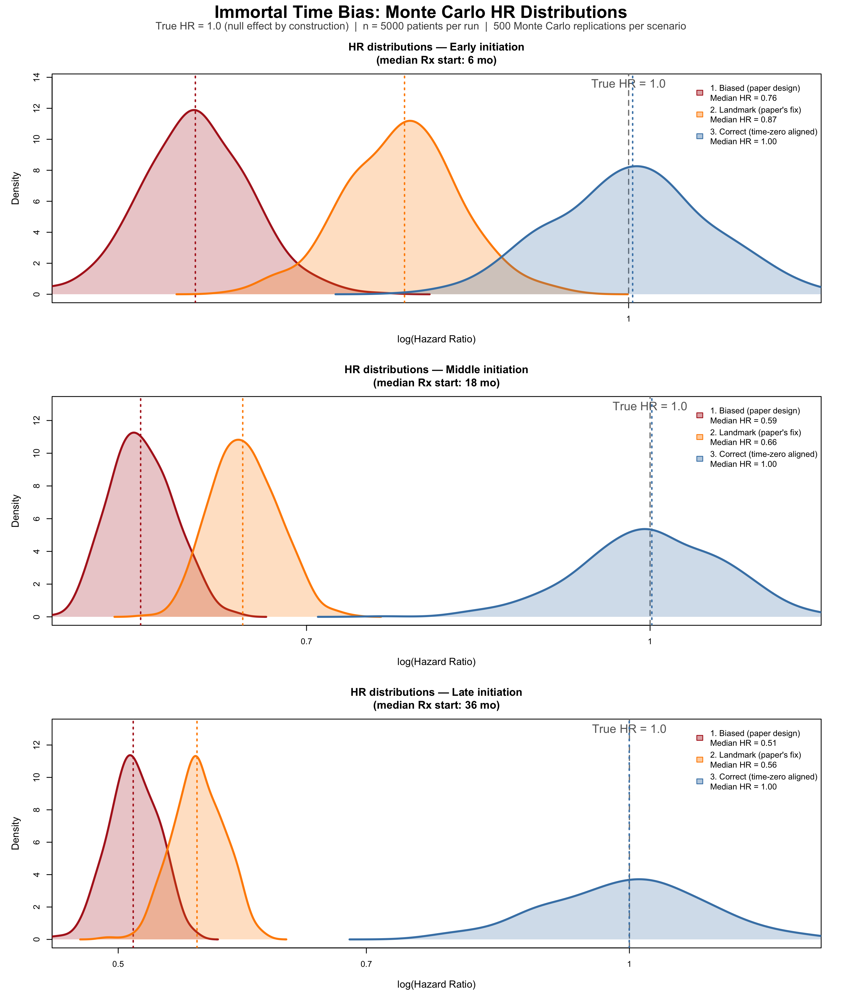

```{r}
## ============================================================
##  Immortal Time Bias Simulation
##  Motivated by: Tatum et al. JAMA Network Open 2026
##  (GLP-1 RAs and breast cancer survival)
##
##  Key question: Can a study design flaw alone produce an
##  apparently massive treatment benefit when the TRUE causal
##  effect is null (HR = 1.0 by construction)?
##
##  Three analyses are compared side-by-side:
##
##  1. BIASED    -- mimics the paper: exposure is classified
##                  retrospectively based on whether a patient
##                  eventually accumulates >=2 Rx after dx;
##                  survival is counted from diagnosis onward.
##                  This creates "immortal time" -- a period
##                  before the 2nd Rx during which exposed
##                  patients cannot die by definition.
##
##  2. LANDMARK  -- mimics the paper's attempted correction:
##                  restrict the cohort to those alive at 6
##                  months, but keep the same retrospective
##                  exposure definition. Immortal time
##                  persists beyond the landmark.
##
##  3. CORRECT   -- proper target trial emulation: exposure
##                  is assigned prospectively at time zero
##                  using a grace period (Rx1 within 3 months
##                  of diagnosis). No immortal time possible.
##
##  Reference for target trial framework:
##  Hernan et al. J Clin Epidemiol 2016;79:70-75.
## ============================================================

## set.seed() fixes the random number generator forreproducible
set.seed(8626) # tgodays date 8/6/26

## survival package provides Surv(), coxph(), and survfit() --
## the core functions for time-to-event analysis in R.
library(survival)

```

## Background
The paper that prompted this post was an observational cohort study by [Tatum et al](https://jamanetwork.com/journals/jamanetworkopen/fullarticle/2848788) reporting a hazard ratio (HR) for all-cause mortality of 0.35 (95% CI 0.21–0.58) in patients with breast cancer (GLP-1 RA vs. no treatment) and 0.09 (95% CI 0.06–0.15) in patients with type 2 diabetes (GLP-1 RA vs. insulin or metformin). These effect sizes are an order of magnitude larger than what has been observed with adjunctive therapy in randomised controlled trials (see [here](https://pubmed.ncbi.nlm.nih.gov/15894097/) and [here](https://pubmed.ncbi.nlm.nih.gov/21802721/)) strongly suggesting a bias, specifically immortal time.     

## Immortal time bias
Immortal time bias may have both misclassification and selection bias components (see [Levesque et. al.](https://www.bmj.com/content/340/bmj.b5087)).
For the present study, consider a patient diagnosed in January 2018 fills her first GLP-1 RA prescription in November 2019, and her second in December 2019 — only at that point does she meet the ≥2 prescription threshold and get classified as "exposed." Yet her survival is counted from January 2018. Those 23 months between diagnosis and the second qualifying prescription are immortal time: she could not have died during that window and still appeared in the exposed group. Yet if she survives, this immortal time becomes inappropriately assigned to the exposed and not correctly to the unexposed group.     

The authors acknowledge the possibility of immortal time bias and proposed landmark analyses to control for this bias. However landmark analyses may partially mitigate immortal time bias but are not a proper fix. A correct landmark analysis requires that exposure be defined and assigned at the landmark time. In the present study, patients in the landmark-defined cohorts may still have filled their qualifying prescriptions well after the 6- or 12-month landmark, carrying immortal time forward from that point. The attenuation of effect sizes in the landmark analyses is modest and entirely consistent with partial, not full, correction.
## An internal confirmatory signal: the SGLT2 inhibitor comparison

The one comparison in this study that does not show a dramatic effect is GLP-1 RA vs. SGLT2 inhibitors, where both groups are defined by active use of a named drug class with both groups having survived long enough to fill prescriptions, making the immortal time approximately symmetrical across arms. The attenuation toward the null in this comparison is exactly what you'd predict if immortal time bias were driving the other results. Studies with true causal effects do not lose them when compared against a similarly defined active drug class.

This study should not be interpreted as evidence that GLP-1 RAs improve breast cancer outcomes. The effect sizes are biologically implausible, the exposure definition structurally guarantees survivor selection, the landmark analyses are insufficient to correct the underlying misalignment³, and the one comparison that incidentally equalises immortal time shows the effect nearly disappear. Prospective evaluation in which eligibility, exposure assignment, and start of follow-up are [explicitly aligned at a common time zero](https://pubmed.ncbi.nlm.nih.gov/27237061/) is needed to avoid these biases.   

A Monte Carlo simulation study can isolate and quantify immortal time bias in the absence of any true treatment effect. By construction, the hazard ratio for all-cause mortality is exactly 1.0: exposed and unexposed patients are drawn from identical survival distributions, so any deviation from HR = 1.0 in the estimated results is pure bias attributable to study design rather than biology.      

The simulation mimics the exposure definition used by Tatum et al., in which GLP-1 RA users are classified retrospectively based on accumulating ≥2 prescriptions at any point after breast cancer diagnosis. Patients who die before filling their second qualifying prescription cannot appear in the exposed group and are silently reassigned to the comparator arm — a structural survivor selection that artificially inflates survival in the exposed group.   

Three analytic approaches are compared across 500 Monte Carlo replications: the biased design replicating the paper's method; a landmark analysis at 6 months, mirroring the paper's attempted correction; and a correctly specified analysis in which exposure is assigned prospectively at time zero within a short grace period, eliminating immortal time entirely.

The results, shown in the probability density plots, are unambiguous. Under the correct design the estimated HR distributions are centred tightly on the true value of 1.0 across all three scenarios. The biased design, by contrast, produces substantial and consistent downward bias in all scenarios: median HRs of 0.76, 0.59, and 0.51 for early, middle, and late prescription initiation respectively. Critically, the magnitude of bias increases directly with the delay between diagnosis and the qualifying second prescription — the longer patients must survive before being classifiable as exposed, the more immortal time accumulates, and the more the exposed group is enriched with long-term survivors. The landmark analysis, intended as a correction, offers only modest attenuation: median HRs shift to 0.87, 0.66, and 0.56 across the three scenarios, remaining far from the null in every case. This is because restricting the observation window to survivors beyond 6 months does not close the exposure ascertainment window — patients whose second prescription arrives at month 18 or month 30 still carry immortal time forward from the landmark. The simulation therefore demonstrates that the dramatic HRs reported by Tatum et al. (0.35 and 0.09) are entirely consistent with what immortal time bias alone can produce, even when the true causal effect is zero.    


```{r eval=FALSE}

## ── SECTION 1: Simulation parameters ────────────────────────
## These values are chosen to broadly match the clinical context of the Tatum et al. 

n     <- 5000   # Patients simulated per Monte Carlo run.
                
n_sim <- 500    # Number of Monte Carlo repetitions per scenario.
                # 500 repetitions gives smooth density curves
                # and stable median/CI estimates for the summary
                # table. Increase to 2000+ for publication-quality
                # precision; decrease to ~100 for quick testing.

true_hr <- 1.0  # The TRUE causal hazard ratio, imposed by construction.
                # Any HR != 1.0 that emerges from analyses 1 or 2 is therefore bias.

lm_time <- 6    # Landmark time in months. Patients who die
                # before this point are excluded from Analysis 2,
                # mirroring the 6-month landmark used in the paper.

rx2_min <- 1    # Minimum gap (months) between 1st and 2nd Rx.
rx2_max <- 3    # Maximum gap (months) between 1st and 2nd Rx.
                # Drawn from Uniform(1, 3) -- a patient who fills
                # their first GLP-1 RA prescription will typically
                # get a refill 1-3 months later. This gap is the
                # "minimum immortal time" a patient must survive
                # after their first Rx before being classifiable
                # as "exposed" under the paper's definition.


## ── Mortality rate ───────────────────────────────────────────
## We model time-to-death as Exponential(rate = mort_rate).
##
## The exponential distribution has the memoryless property:
## hazard rate is assumed constant  - a simplification but provides example
##
## For an Exponential distribution, the median survival time =
##   log(2) / rate    (because P(T > t) = exp(-rate * t),
##                     set equal to 0.5 and solve for t)
##
## Rearranging: rate = log(2) / median
##
## We choose median survival = 60 months (5 years), which is
## broadly consistent with overall survival in a mixed
## stage I-III breast cancer cohort with comorbidities.
## This gives roughly 40% mortality at 5 years and ~55% at 10
## years in the simulation -- plausible for this population.
##
## SENSITIVITY: changing this value (e.g. to log(2)/48 for a
## sicker cohort) will alter the absolute magnitude of the bias
## but not the qualitative finding that analyses 1 and 2 are
## biased while analysis 3 is not.

mort_rate <- log(2) / 60   # => median survival ~60 months


## ── GLP-1 RA initiation rates ────────────────────────────────
## Three scenarios represent how quickly, on average, patients
## in the EHR database start a GLP-1 RA after BC diagnosis:
##
##   "early"  -- median 6 months:  many patients were already on
##               GLP-1 RAs or started very soon after diagnosis.
##               This minimizes immortal time, so bias is smaller.
##
##   "middle" -- median 18 months: a realistic central scenario
##               for an EHR database spanning 2006-2023, where
##               GLP-1 RAs became widely prescribed only from
##               ~2015 onward. Many patients starting later in
##               the observation window will be "late starters."
##
##   "late"   -- median 36 months: represents patients who
##               initiated GLP-1 RAs well after diagnosis.
##               This maximizes immortal time and therefore
##               produces the worst bias.
##
## The formula is again rate = log(2) / median, same logic as
## mort_rate above.

init_rates <- c(early  = log(2) / 6,
                middle = log(2) / 18,
                late   = log(2) / 36)


## Administrative censoring: follow-up ends at 10 years (120 months) 

max_fu <- 120


## ── SECTION 2: Initialization ───────────────────────

results <- data.frame()


## ── SECTION 3: Monte Carlo loop ─────────────────────────────
## Outer loop: iterate over the three initiation-rate scenarios.
## Inner loop: repeat the simulation n_sim times within each
## scenario to build up a distribution of HR estimates.

for (scenario in names(init_rates)) {

  init_rate <- init_rates[scenario]   # pull rate for this scenario

  ## Pre-allocate numeric vectors to store one HR per simulation
  
  hr_biased   <- numeric(n_sim)
  hr_landmark <- numeric(n_sim)
  hr_correct  <- numeric(n_sim)

  for (s in seq_len(n_sim)) {

    ## ── 3a. Generate true survival times ──────────────────────
    ## rexp(n, rate) draws n independent exponential random
    ## variables with the given rate. Because true_hr = 1.0,
    ## ALL patients -- whether "intended" users or not -- are
    ## drawn from the SAME distribution. There is no biological
    ## treatment effect whatsoever.
    surv_time <- rexp(n, rate = mort_rate)

    ## event indicator: 1 if the patient dies (i.e. natural death occurs within 10 years),
    ## 0 if still alive at 120 months (censored).
    ## ifelse() is vectorised: applies element-wise to surv_time.
    event <- ifelse(surv_time < max_fu, 1L, 0L)

    ## pmin() = parallel minimum: for each patient, replace their
    ## survival time with max_fu if they would have been followed
    ## beyond 120 months. This applies administrative censoring.
    surv_time <- pmin(surv_time, max_fu)


    ## ── 3b. Generate prescription timing ──────────────────────
    ## rx1_time: time from diagnosis to 1st GLP-1 RA prescription.
    ## Drawn from Exponential(init_rate); some values will exceed
    ## surv_time (i.e. the patient dies before ever getting Rx1).
    rx1_time <- rexp(n, rate = init_rate)

    ## rx2_gap: gap between 1st and 2nd prescription.
    ## runif(n, min, max) draws from Uniform(rx2_min, rx2_max).
    ## This represents the refill interval -- typically 1-3 months.
    rx2_gap  <- runif(n, rx2_min, rx2_max)

    ## rx2_time: time from diagnosis to the QUALIFYING 2nd
    ## prescription. This is the moment the paper's exposure
    ## definition is satisfied (>=2 prescriptions).
    ## The gap between diagnosis and rx2_time is the window of
    ## immortal time for any patient who fills both prescriptions.
    rx2_time <- rx1_time + rx2_gap


    ## ── 3c. Assign treatment intent ───────────────────────────
    ## In the real world, some patients are "intended" GLP-1 RA
    ## users (their physician plans to prescribe it) and some are
    ## not. We model this as a 50/50 coin flip, independent of
    ## mortality. rbinom(n, 1, prob) draws n Bernoulli(prob) RVs:
    ## 1 = intended user, 0 = not intended.
    ##
    ## Key insight: "intended" is the TRUE treatment group
    ## membership. It is independent of survival by construction.
    ## The biased analysis will IGNORE this and instead use
    ## observed prescription accumulation to classify exposure,
    ## creating survivor selection.
    intended <- rbinom(n, 1, prob = 0.5)


    ## ── 3d. Derive OBSERVED exposure (biased definition) ──────
    ## A patient is observed as "exposed" only if:
    ##   (a) they were intended to receive GLP-1 RA (intended==1)
    ##   AND
    ##   (b) they survived long enough to accumulate 2 Rx
    ##       (rx2_time < surv_time)
    ##
    ## Condition (b) is the source of immortal time bias.
    ## Any intended user who died before rx2_time is silently
    ## reclassified into the comparator arm. The exposed group
    ## therefore contains ONLY patients who were biologically
    ## lucky enough to survive through their rx2_time -- they
    ## are a survivor-selected subset by definition.
    ##
    ## as.integer() converts TRUE/FALSE to 1/0.
    obs_exposed <- as.integer(intended == 1 & rx2_time < surv_time)


    ## ═════════════════════════════════════════════════════════
    ## ANALYSIS 1: BIASED  (replicates the paper's design)
    ## ═════════════════════════════════════════════════════════
    ## The Cox model is fitted with the observed (biased) exposure.
    ## Follow-up starts at diagnosis for everyone.
    ## The [0, rx2_time) window is immortal for the exposed group
    ## because rx2_time < surv_time is required for exposure --
    ## no exposed patient can have died before rx2_time.
    ## This artificially inflates survival in the exposed group.

    df_biased <- data.frame(
      time    = surv_time,
      event   = event,
      exposed = obs_exposed
    )

    ## coxph() fits a Cox proportional hazards model.
    ## Surv(time, event) creates the survival object:
    ##   time  = follow-up duration
    ##   event = 1 (died) or 0 (censored)
    ## ~ exposed fits one binary predictor.
    fit_b <- coxph(Surv(time, event) ~ exposed, data = df_biased)

    ## coef() extracts the log-HR; exp() converts to the HR scale.
    ## ["exposed"] selects the named coefficient for our predictor.
    hr_biased[s] <- exp(coef(fit_b)["exposed"])


    ## ═════════════════════════════════════════════════════════
    ## ANALYSIS 2: LANDMARK  (replicates the paper's "fix")
    ## ═════════════════════════════════════════════════════════
    ## Restrict the cohort to patients still alive at lm_time
    ## (6 months). This removes patients who died very early,
    ## which partially -- but not fully -- removes immortal time.
    ##
    ## The critical flaw: exposure is STILL classified based on
    ## whether the patient eventually fills >=2 Rx at ANY point
    ## after diagnosis. A patient who fills their 2nd Rx at
    ## month 24 is still "exposed," and the period from month 6
    ## to month 24 remains immortal time for that patient.
    ## The landmark shifts the window but doesn't close it.

    alive_lm <- surv_time > lm_time   # logical vector: TRUE if alive at landmark

    df_lm <- data.frame(
      ## Subtract lm_time to reset the clock: follow-up now runs
      ## from the landmark (month 6), not from diagnosis.
      time    = surv_time[alive_lm] - lm_time,
      event   = event[alive_lm],

      ## Crucially, exposure is still obs_exposed -- defined by
      ## eventual Rx accumulation regardless of when it occurred
      ## relative to the landmark. This is the flaw.
      exposed = obs_exposed[alive_lm]
    )

    ## Guard against degenerate simulation runs where (by chance)
    ## almost no one or almost everyone is exposed -- Cox would
    ## fail to converge. The threshold of 5 exposed and 5
    ## unexposed is conservative but sufficient.
    if (sum(df_lm$exposed) > 5 & sum(df_lm$exposed) < nrow(df_lm) - 5) {
      fit_lm <- coxph(Surv(time, event) ~ exposed, data = df_lm)
      hr_landmark[s] <- exp(coef(fit_lm)["exposed"])
    } else {
      hr_landmark[s] <- NA   # mark as missing; excluded from summaries
    }


    ## ═════════════════════════════════════════════════════════
    ## ANALYSIS 3: CORRECT  (target trial emulation)
    ## ═════════════════════════════════════════════════════════
    ## Exposure is assigned prospectively at time zero, based
    ## solely on information available AT OR BEFORE diagnosis.
    ## A "grace period" of 3 months is allowed: if an intended
    ## user fills their first Rx within 3 months of diagnosis,
    ## they are classified as exposed from time zero onward.
    ##
    ## Why a grace period? In a real target trial, we would
    ## not require the prescription to happen on the exact day
    ## of diagnosis. A short grace period emulates the practical
    ## reality that treatment initiation follows shortly after
    ## the clinical decision to prescribe. Critically, the grace
    ## period must be FIXED AND SHORT -- long grace periods
    ## reintroduce immortal time.
    ##
    ## There is NO immortal time here because:
    ##   - Everyone's follow-up starts at diagnosis
    ##   - Exposure classification uses only rx1_time (the first
    ##     Rx), not rx2_time (which occurs after follow-up starts)
    ##   - A patient who dies at month 2 before filling Rx1 is
    ##     correctly counted as unexposed, not silently moved
    ##     into the comparator group after the fact

    grace       <- 3
    correct_exp <- as.integer(intended == 1 & rx1_time <= grace)

    df_correct <- data.frame(
      time    = surv_time,
      event   = event,
      exposed = correct_exp
    )
    fit_c <- coxph(Surv(time, event) ~ exposed, data = df_correct)
    hr_correct[s] <- exp(coef(fit_c)["exposed"])

  }   # end inner loop (Monte Carlo runs)


  ## Append this scenario's results to the master data frame.
  ## rep(..., each = n_sim) creates a label vector of length
  ## 3 * n_sim that tags each HR with its analysis type.
  results <- rbind(results, data.frame(
    scenario = scenario,
    analysis = rep(c("1. Biased\n(paper design)",
                     "2. Landmark\n(paper's fix)",
                     "3. Correct\n(time-zero aligned)"),
                   each = n_sim),
    hr       = c(hr_biased, hr_landmark, hr_correct)
  ))

}   # end outer loop (scenarios)


## ── SECTION 4: Summary table ─────────────────────────────────
## Print median HR and empirical 95% interval (2.5th to 97.5th
## percentile of the simulation distribution) for each
## scenario x analysis combination.
##
## sprintf() formats strings like printf in C:
##   %-12s = left-aligned string in 12-character field
##   %.3f  = floating point with 3 decimal places
## strrep() repeats a character string n times (used for the
## horizontal rule).

cat("\n=== MEDIAN HAZARD RATIOS (true HR = 1.0) ===\n\n")
cat(sprintf("%-12s  %-28s  %s\n",
            "Scenario", "Analysis", "Median HR [2.5%-97.5%]"))
cat(strrep("-", 65), "\n")

for (sc in names(init_rates)) {
  for (an in unique(results$analysis)) {
    sub <- results$hr[results$scenario == sc & results$analysis == an]
    sub <- sub[!is.na(sub)]   # drop any NA runs (degenerate landmark cases)
    cat(sprintf("%-12s  %-28s  %.3f [%.3f - %.3f]\n",
                sc,
                gsub("\n", " ", an),   # remove newlines for console output
                median(sub),
                quantile(sub, 0.025),
                quantile(sub, 0.975)))
  }
  cat("\n")
}


## ── SECTION 5: Single illustrative run for KM plots ─────────
## Re-simulate one dataset using the "middle" scenario for use
## in the Kaplan-Meier panels. A new seed (7) ensures these KM
## curves are a "typical" run, not the same random draw as the
## Monte Carlo loop above.

set.seed(7)
sc        <- "middle"
init_rate <- init_rates[sc]

surv_time   <- rexp(n, rate = mort_rate)
event       <- ifelse(surv_time < max_fu, 1L, 0L)
surv_time   <- pmin(surv_time, max_fu)
rx1_time    <- rexp(n, rate = init_rate)
rx2_gap     <- runif(n, rx2_min, rx2_max)
rx2_time    <- rx1_time + rx2_gap
intended    <- rbinom(n, 1, prob = 0.5)
obs_exp     <- as.integer(intended == 1 & rx2_time < surv_time)
correct_exp <- as.integer(intended == 1 & rx1_time <= 3)


## ═══════════════════════════════════════════════════════════════
## SECTION 6: OUTPUT FILE 1 — Kaplan-Meier plots
## Saved to the same directory as the original simulation output.
## Two panels side by side: biased vs correct design, both from
## the same single illustrative run (middle scenario, seed 7).
## ═══════════════════════════════════════════════════════════════

## png() opens a graphics device writing to a PNG file.
##   width, height: dimensions in pixels
##   res: resolution in dots per inch (300 = print quality)
## Every plot() call between png() and dev.off() writes to this file.
png("../glp_breastCA/immortal_time_KM.png",
    width = 3200, height = 1800, res = 300)

## layout() divides the device into panels.
## matrix(c(1,1, 2,3), nrow=2, byrow=TRUE):
##   Row 1: panel 1 spans both columns  --> title strip
##   Row 2: panel 2 (left KM), panel 3 (right KM)
## heights controls the relative vertical share of each row.
layout(matrix(c(1,1, 2,3), nrow=2, byrow=TRUE),
       heights = c(0.15, 1))

## ── Title strip ──────────────────────────────────────────────
## par(mar=...) sets plot margins: c(bottom, left, top, right).
## All zeros removes whitespace around the title text box.
par(mar = c(0,0,0,0))
plot.new()   # blank canvas with unit [0,1] x [0,1] coordinates
text(0.5, 0.65,
     "Immortal Time Bias: Kaplan-Meier Illustration",
     cex = 2.0, font = 2, adj = 0.5)
text(0.5, 0.15,
     paste0("True HR = 1.0 (null effect by construction)  |  n = ", n,
            " patients  |  'Middle' scenario (median GLP-1 RA start: 18 mo post-diagnosis)"),
     cex = 1.2, adj = 0.5, col = "grey30")

## ── KM panels ────────────────────────────────────────────────
## Store both configurations in a list so we loop rather than
## duplicate code. Each list element holds:
##   exp   -- the exposure vector (biased or correct)
##   title -- panel title
##   sub   -- explanatory subtitle placed in the bottom margin
km_configs <- list(
  list(exp   = obs_exp,
       title = "Biased design  (paper method)",
       sub   = "Exposed = survived to accumulate \u22652 Rx at any time post-diagnosis  [immortal time accrues]"),
  list(exp   = correct_exp,
       title = "Correct design  (time-zero aligned)",
       sub   = "Exposed = Rx1 filled within 3-month grace period of diagnosis  [no immortal time]")
)

for (cfg in km_configs) {

  par(mar = c(6, 5.5, 4, 2))

  ## survfit() computes Kaplan-Meier survival estimates stratified
  ## by cfg$exp (0 = comparator, 1 = GLP-1 RA). The result is a
  ## survfit object containing S(t) at each event time.
  km <- survfit(Surv(surv_time, event) ~ cfg$exp)

  ## Colour convention: steelblue = exposed (GLP-1 RA users),
  ## firebrick = comparator. survfit() orders strata 0 before 1,
  ## so col = c("firebrick","steelblue") matches that order.
  col_vec <- c("firebrick", "steelblue")

  ## plot.survfit() draws the step-function KM curves.
  ##
  ##   CORRECTION from previous version:
  ##   fun = "event" was plotting 1 - S(t) (cumulative incidence),
  ##   causing curves to start at 0 and rise upward. Standard KM
  ##   survival curves show S(t): they start at 1.0 and decline.
  ##   Removing fun= entirely gives the default S(t) behaviour.
  ##
  ##   conf.int = FALSE suppresses the 95% CI shaded bands.
  ##   With n=5000 the bands are extremely narrow and add clutter.
  ##
  ##   ylim = c(0, 1): full probability axis. Conventional and
  ##   avoids any appearance of axis truncation/manipulation.
  ##
  ##   mark.time = FALSE: suppresses censoring tick marks.
  ##   With 5000 patients these would be near-continuous.
  plot(km,
       col       = col_vec,
       lwd       = 2.8,
       conf.int  = FALSE,
       xlab      = "Months since diagnosis",
       ylab      = "Survival probability",
       main      = cfg$title,
       cex.main  = 1.5,
       cex.lab   = 1.25,
       ylim      = c(0, 1),
       mark.time = FALSE)

  ## Re-fit Cox model on this illustrative run to annotate the HR.
  ## exp(coef(...)) converts log-HR returned by coxph() to HR scale.
  df_tmp <- data.frame(time    = surv_time,
                       event   = event,
                       exposed = cfg$exp)
  hr_val <- exp(coef(coxph(Surv(time, event) ~ exposed, data = df_tmp)))

  ## legend() places a key inside the plot area.
  ##   "bottomleft": as curves decline and thin out, the
  ##   bottom-left corner stays uncluttered longest.
  ##   survfit() orders strata 0 then 1, so comparator is listed
  ##   first (firebrick), GLP-1 RA second (steelblue).
  legend("bottomleft",
         legend = c(paste0("Comparator      (n=", sum(cfg$exp==0), ")"),
                    paste0("GLP-1 RA users  (n=", sum(cfg$exp==1), ")")),
         col    = col_vec,
         lwd    = 2.8,
         bty    = "n",
         cex    = 1.15)

  ## mtext() writes text into a margin rather than the plot area.
  ##   side=3 = top margin. Colour: red if clearly biased
  ##   (|HR - 1| > 0.15), darkgreen if close to the true null.
  mtext(sprintf("Cox HR = %.2f   (true HR = 1.00)", hr_val),
        side = 3, line = 0.3, cex = 1.3, font = 2,
        col  = ifelse(abs(hr_val - 1) > 0.15, "firebrick", "darkgreen"))

  ## side=1 = bottom margin. Plain-language description of the
  ## exposure definition so the panel is self-contained.
  mtext(cfg$sub, side = 1, line = 4.5, cex = 0.95, col = "grey35", adj = 0)
}

## dev.off() finalises and writes the KM PNG file to disk.
dev.off()
cat("KM plot saved to ../glp_breastCA/immortal_time_KM.png\n")


## ═══════════════════════════════════════════════════════════════
## SECTION 7: OUTPUT FILE 2 — HR density distributions
## Three panels (one per initiation scenario) summarising the
## full Monte Carlo distribution of Cox HR estimates under each
## analysis method across all 500 simulation runs.
## ═══════════════════════════════════════════════════════════════

png("../glp_breastCA/immortal_time_HR_densities.png",
    width = 3200, height = 3800, res = 300)

## Single-column layout: title strip + one density panel per scenario.
layout(matrix(c(1, 2, 3, 4), nrow=4, byrow=TRUE),
       heights = c(0.10, 1, 1, 1))

## ── Title strip ──────────────────────────────────────────────
par(mar = c(0,0,0,0))
plot.new()
text(0.5, 0.65,
     "Immortal Time Bias: Monte Carlo HR Distributions",
     cex = 2.0, font = 2, adj = 0.5)
text(0.5, 0.15,
     paste0("True HR = 1.0 (null effect by construction)  |  n = ", n,
            " patients per run  |  ", n_sim, " Monte Carlo replications per scenario"),
     cex = 1.2, adj = 0.5, col = "grey30")

## ── Density panels ───────────────────────────────────────────
## For each scenario, show the Monte Carlo distribution of Cox
## HR estimates under each analysis as overlapping kernel density
## curves plotted on the log(HR) scale (symmetric, centred at 0
## under the null). Any distribution not straddling log(HR)=0
## is demonstrably biased despite the null true effect.

## ── Panels 4-7: HR distribution densities ───────────────────
## For each scenario, show the full Monte Carlo distribution of
## estimated HRs under each analysis method as overlapping
## kernel density curves. Plotting on the log(HR) scale keeps
## the distributions approximately symmetric and makes the
## deviation from log(1) = 0 (the true value) visually obvious.

scenario_labels <- c(
  early  = "Early initiation\n(median Rx start: 6 mo)",
  middle = "Middle initiation\n(median Rx start: 18 mo)",
  late   = "Late initiation\n(median Rx start: 36 mo)"
)
analysis_levels <- c("1. Biased\n(paper design)",
                     "2. Landmark\n(paper's fix)",
                     "3. Correct\n(time-zero aligned)")
analysis_cols   <- c("firebrick", "darkorange", "steelblue")

for (sc in names(init_rates)) {
  par(mar = c(5, 5, 4, 2))

  ## lapply() applies a function to each element of a list/vector
  ## and returns a list of results. Here we extract the HR vector
  ## for each analysis type within the current scenario, dropping
  ## NA values from degenerate landmark runs.
  dat_list <- lapply(analysis_levels, function(an) {
    v <- results$hr[results$scenario == sc & results$analysis == an]
    v[!is.na(v)]
  })

  ## Determine x-axis limits from the data, clipped to [0, 3]
  ## on the HR scale to prevent extreme outliers from distorting
  ## the plot. quantile() with 0.005/0.995 trims 0.5% from each
  ## tail. We then log-transform for plotting.
  all_vals <- unlist(dat_list)
  xlim     <- c(max(0.01, quantile(all_vals, 0.005)),
                min(3,    quantile(all_vals, 0.995)))

  ## density() computes a kernel density estimate of a numeric
  ## vector. adjust=1.2 slightly over-smooths relative to the
  ## default bandwidth -- reduces noise in the tails.
  ## We estimate on the log scale so the density is symmetric
  ## and easy to compare across analyses.
  dens_list <- lapply(dat_list, function(v) density(log(v), adjust = 1.2))

  ## Set y-axis ceiling 15% above the tallest density peak,
  ## so no curve is clipped. sapply() is like lapply() but
  ## simplifies the result to a vector.
  ymax <- max(sapply(dens_list, function(d) max(d$y))) * 1.15

  ## plot(NA, ...) opens an empty plot with the correct axis
  ## ranges but draws nothing. We then add elements manually.
  ## xaxt="n" suppresses the automatic x-axis so we can draw
  ## a custom one with HR values (rather than log-HR values).
  plot(NA, xlim = log(xlim), ylim = c(0, ymax),
       xlab = "log(Hazard Ratio)",
       ylab = "Density",
       main = paste0("HR distributions — ", scenario_labels[sc]),
       cex.main = 1.25, cex.lab = 1.15,
       xaxt = "n")

  ## Custom x-axis: axis(1, at=..., labels=...) places tick marks
  ## at log(HR) positions but labels them with the original HR
  ## values for readability. Only ticks within the visible range
  ## (xlim) are kept.
  hr_ticks <- c(0.05, 0.1, 0.2, 0.35, 0.5, 0.7, 1.0, 1.4, 2.0)
  hr_ticks <- hr_ticks[hr_ticks >= xlim[1] & hr_ticks <= xlim[2]]
  axis(1, at = log(hr_ticks), labels = hr_ticks, cex.axis = 0.95)

  ## Vertical reference line at log(1) = 0 marks the TRUE HR.
  ## Any distribution that does not straddle this line is biased.
  abline(v = 0, lty = 2, col = "grey50", lwd = 1.5)
  mtext("True HR = 1.0", side = 3, at = 0, line = -1.5,
        cex = 0.9, col = "grey40")

  ## Draw density curves with semi-transparent fill.
  ## polygon() fills the area under a curve defined by (x, y)
  ##   coordinates. We add (x[1], 0) and (x[end], 0) implicitly
  ##   by closing the polygon.
  ## adjustcolor(col, alpha.f=0.25) makes the fill 25% opaque
  ##   so overlapping distributions remain visible.
  ## lines() draws the curve outline in the solid colour.
  ## abline(v=...) adds a dotted vertical line at the median HR
  ##   of each analysis, making the location of the distribution
  ##   easy to read even where curves overlap.
  for (i in seq_along(dat_list)) {
    d <- dens_list[[i]]
    polygon(d$x, d$y,
            col    = adjustcolor(analysis_cols[i], alpha.f = 0.25),
            border = NA)
    lines(d$x, d$y, col = analysis_cols[i], lwd = 2.5)
    med_val <- median(dat_list[[i]])
    abline(v   = log(med_val),
           col = analysis_cols[i],
           lty = 3, lwd = 1.8)
  }

  ## Legend: mapply() is a multivariate version of sapply() --
  ## it applies a function over corresponding elements of
  ## multiple vectors/lists simultaneously. Here we pair each
  ## analysis label with its median HR to build legend text.
  ## SIMPLIFY=TRUE returns a character vector rather than a list.
  legend_labels <- mapply(function(an, dat) {
    sprintf("%s\nMedian HR = %.2f",
            gsub("\n", " ", an),   # flatten multi-line label
            median(dat))
  }, analysis_levels, dat_list, SIMPLIFY = TRUE)

  ## fill= draws filled rectangles in the legend (cleaner than
  ## col= lines when we also have polygon fills in the plot).
  ## y.intersp=1.6 adds vertical spacing between legend entries.
  legend("topright", legend = legend_labels,
         fill   = adjustcolor(analysis_cols, alpha.f = 0.4),
         border = analysis_cols,
         bty    = "n", cex = 0.95, y.intersp = 1.6)
}

## dev.off() finalises the HR density PNG file and writes to disk.
dev.off()
cat("HR density plot saved to ../glp_breastCA/immortal_time_HR_densities.png\n")

```

